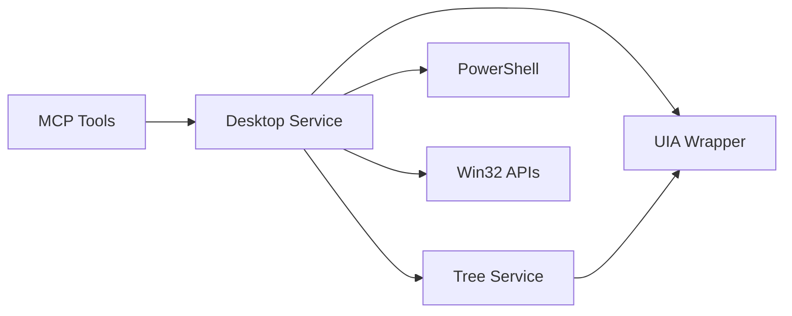

## Overview

The **Desktop Service** (`desktop/service.py`) is the primary orchestration layer in Windows-MCP. It manages all high-level automation operations including window management, screenshots, mouse/keyboard actions, and clipboard operations.

<Card title="Location" icon="folder">
  `src/windows_mcp/desktop/service.py` (1,275 lines)
</Card>

## Architecture



## Core Responsibilities

<CardGroup cols={2}>
  <Card title="Window Management" icon="window-maximize">
    Launch, resize, switch, and enumerate application windows
  </Card>
  <Card title="Screenshots" icon="camera">
    Capture and annotate desktop screenshots with UI elements
  </Card>
  <Card title="Input Automation" icon="keyboard">
    Mouse clicks, keyboard typing, and shortcuts
  </Card>
  <Card title="UI Discovery" icon="magnifying-glass">
    Interface with Tree service for element identification
  </Card>
</CardGroup>

## Key Methods

### Initialization

```python src/windows_mcp/desktop/service.py
class Desktop:
    def __init__(self):
        self.encoding = getpreferredencoding()
        self.tree = Tree(self)  # Initialize Tree service
        self.desktop_state = None
```

The Desktop service initializes with a reference to the Tree service for UI element discovery.

### State Capture

The `get_state()` method is the core of the Snapshot tool, capturing complete desktop state:

```python src/windows_mcp/desktop/service.py
def get_state(
    self,
    use_annotation: bool = True,
    use_vision: bool = False,
    use_dom: bool = False,
    use_ui_tree: bool = True,
    as_bytes: bool = False,
    scale: float = 1.0,
    grid_lines: tuple[int, int] | None = None,
    display_indices: list[int] | None = None,
    max_image_size: Size | None = None,
) -> DesktopState:
    # 1. Get window handles and active window
    controls_handles = self.get_controls_handles()
    windows, windows_handles = self.get_windows(controls_handles)
    active_window = self.get_active_window(windows)
    
    # 2. Get cursor position and virtual desktops
    cursor_position = self.get_cursor_location()
    active_desktop = get_current_desktop()
    all_desktops = get_all_desktops()
    
    # 3. Capture UI tree if requested
    if use_ui_tree:
        tree_state = self.tree.get_state(
            active_window_handle, 
            other_windows_handles, 
            use_dom=use_dom
        )
    
    # 4. Capture and annotate screenshot if requested
    if use_vision:
        if use_annotation:
            screenshot = self.get_annotated_screenshot(
                nodes=tree_state.interactive_nodes,
                cursor_pos=cursor_position
            )
        else:
            screenshot = self.get_screenshot()
    
    # 5. Return complete state
    return DesktopState(...)
```

<Accordion title="State Capture Flow">
  1. **Window Enumeration**: Enumerate all visible windows and identify the active window
  2. **Cursor & Desktop Info**: Capture cursor position and virtual desktop state
  3. **UI Tree Extraction**: Call Tree service to identify interactive/scrollable elements
  4. **Screenshot Capture**: Optionally capture and annotate screenshot with bounding boxes
  5. **State Assembly**: Combine all information into a DesktopState object
</Accordion>

### Window Operations

#### Launch Applications

```python src/windows_mcp/desktop/service.py
def launch_app(self, name: str) -> tuple[str, int, int]:
    # 1. Get installed apps from Start Menu
    apps_map = self.get_apps_from_start_menu()
    
    # 2. Fuzzy match the app name
    matched_app = process.extractOne(name, apps_map.keys(), score_cutoff=70)
    if matched_app is None:
        return (f"{name.title()} not found in start menu.", 1, 0)
    
    app_name, _ = matched_app
    appid = apps_map.get(app_name)
    
    # 3. Launch via PowerShell
    if os.path.exists(appid) or "\\" in appid:
        # File path - launch directly
        command = f"Start-Process {ps_quote(appid)} -PassThru"
    else:
        # UWP app - launch via shell:AppsFolder
        command = f"Start-Process {ps_quote(f'shell:AppsFolder\\{appid}')}"
    
    response, status = self.execute_command(command)
    return response, status, pid
```

<Info>
  The Desktop service uses **fuzzy matching** with a 70% threshold to find apps, making it resilient to spelling variations and typos.
</Info>

#### Switch to Window

```python src/windows_mcp/desktop/service.py
def switch_app(self, name: str):
    # Find window by fuzzy name match
    window, error = self._find_window_by_name(name)
    if window is None:
        return error, 1
    
    target_handle = window.handle
    was_minimized = uia.IsIconic(target_handle)
    
    # Bring to foreground
    self.bring_window_to_top(target_handle)
    
    if was_minimized:
        return f"Restored {window.name.title()} from minimized"
    else:
        return f"Switched to {window.name.title()}"
```

#### Bring Window to Top

```python src/windows_mcp/desktop/service.py
def bring_window_to_top(self, target_handle: int):
    # Restore if minimized
    if win32gui.IsIconic(target_handle):
        win32gui.ShowWindow(target_handle, win32con.SW_RESTORE)
    
    foreground_handle = win32gui.GetForegroundWindow()
    foreground_thread, _ = win32process.GetWindowThreadProcessId(foreground_handle)
    target_thread, _ = win32process.GetWindowThreadProcessId(target_handle)
    
    # Attach thread inputs for reliable foreground switch
    try:
        win32process.AttachThreadInput(foreground_thread, target_thread, True)
        win32gui.SetForegroundWindow(target_handle)
        win32gui.BringWindowToTop(target_handle)
    finally:
        win32process.AttachThreadInput(foreground_thread, target_thread, False)
```

<Note>
  Windows requires **thread input attachment** to reliably bring windows to the foreground from another process.
</Note>

### Input Automation

#### Mouse Click

```python src/windows_mcp/desktop/service.py
def click(self, loc: tuple[int, int], button: str = "left", clicks: int = 2):
    x, y = loc
    
    if clicks == 0:
        uia.SetCursorPos(x, y)  # Hover only
        return
    
    match button:
        case "left":
            if clicks >= 2:
                dbl_wait = uia.GetDoubleClickTime() / 2000.0
                for i in range(clicks):
                    uia.Click(x, y, waitTime=dbl_wait if i < clicks - 1 else 0.5)
            else:
                uia.Click(x, y)
        case "right":
            for _ in range(clicks):
                uia.RightClick(x, y)
        case "middle":
            for _ in range(clicks):
                uia.MiddleClick(x, y)
```

#### Keyboard Typing

```python src/windows_mcp/desktop/service.py
def type(
    self,
    loc: tuple[int, int],
    text: str,
    caret_position: Literal["start", "idle", "end"] = "idle",
    clear: bool = False,
    press_enter: bool = False,
):
    x, y = loc
    uia.Click(x, y)  # Focus the element
    
    # Move caret if requested
    if caret_position == "start":
        uia.SendKeys("{Home}", waitTime=0.05)
    elif caret_position == "end":
        uia.SendKeys("{End}", waitTime=0.05)
    
    # Clear existing text if requested
    if clear:
        uia.SendKeys("{Ctrl}a", waitTime=0.05)
        uia.SendKeys("{Back}", waitTime=0.05)
    
    # Type the text
    escaped_text = _escape_text_for_sendkeys(text)
    uia.SendKeys(escaped_text, interval=0.02, waitTime=0.05)
    
    # Press Enter if requested
    if press_enter:
        uia.SendKeys("{Enter}", waitTime=0.05)
```

<Accordion title="Text Escaping">
  Special characters like `{` and `}` must be escaped for SendKeys:
  
  ```python
  def _escape_text_for_sendkeys(text: str) -> str:
      result = []
      for ch in text:
          if ch == "{":
              result.append("{{}")  # Escape opening brace
          elif ch == "}":
              result.append("{}}")  # Escape closing brace
          elif ch == "\n":
              result.append("{Enter}")
          elif ch == "\t":
              result.append("{Tab}")
          else:
              result.append(ch)
      return "".join(result)
  ```
</Accordion>

### Screenshot Capture

#### Basic Screenshot

```python src/windows_mcp/desktop/service.py
def get_screenshot(self, capture_rect: uia.Rect | None = None) -> Image.Image:
    try:
        screenshot = ImageGrab.grab(all_screens=True)
    except Exception:
        screenshot = ImageGrab.grab()  # Fallback to primary screen
    return self._crop_screenshot(screenshot, capture_rect)
```

#### Annotated Screenshot

```python src/windows_mcp/desktop/service.py
def get_annotated_screenshot(
    self,
    nodes: list[TreeElementNode],
    cursor_pos: tuple[int, int] | None = None,
    grid_lines: tuple[int, int] | None = None,
    capture_rect: uia.Rect | None = None,
) -> Image.Image:
    screenshot = self.get_screenshot()
    
    # Add padding for labels
    padding = 5
    padded_screenshot = Image.new(
        "RGB", 
        (screenshot.width + padding*2, screenshot.height + padding*2),
        color=(255, 255, 255)
    )
    padded_screenshot.paste(screenshot, (padding, padding))
    
    draw = ImageDraw.Draw(padded_screenshot)
    font = ImageFont.truetype("arial.ttf", 12)
    
    # Draw bounding boxes and labels for each element
    for label, node in enumerate(nodes):
        box = node.bounding_box
        color = get_random_color()
        
        # Draw rectangle
        draw.rectangle(
            (box.left + padding, box.top + padding, 
             box.right + padding, box.bottom + padding),
            outline=color, 
            width=2
        )
        
        # Draw label
        draw.rectangle(
            [(label_x1, label_y1), (label_x2, label_y2)],
            fill=color
        )
        draw.text((label_x1 + 2, label_y1 + 2), str(label), fill="white")
    
    # Draw cursor highlight if provided
    if cursor_pos:
        cx, cy = cursor_pos
        r = 15
        draw.ellipse([cx - r, cy - r, cx + r, cy + r], outline="red", width=3)
        draw.text((cx + r + 2, cy - r), "CURSOR", fill="red")
    
    return padded_screenshot
```

<Note>
When `use_annotation=True`, the screenshot includes colored bounding boxes around detected UI elements for easier visual debugging.
</Note>

### PowerShell Execution

```python src/windows_mcp/desktop/service.py
def execute_command(self, command: str, timeout: int = 10) -> tuple[str, int]:
    # Set UTF-8 encoding for PowerShell
    utf8_command = (
        "$OutputEncoding = [System.Text.Encoding]::UTF8; "
        "[Console]::OutputEncoding = [System.Text.Encoding]::UTF8; "
        f"{command}"
    )
    
    # Base64 encode for safe transmission
    encoded = base64.b64encode(utf8_command.encode("utf-16le")).decode("ascii")
    
    # Rebuild PATH from registry for system executables
    env = os.environ.copy()
    with winreg.OpenKey(winreg.HKEY_LOCAL_MACHINE, 
                        r"SYSTEM\CurrentControlSet\Control\Session Manager\Environment") as key:
        machine_path = winreg.QueryValueEx(key, "PATH")[0]
        env["PATH"] = machine_path + ";" + env.get("PATH", "")
    
    # Execute PowerShell
    shell = "pwsh" if shutil.which("pwsh") else "powershell"
    result = subprocess.run(
        [shell, "-NoProfile", "-EncodedCommand", encoded],
        capture_output=True,
        timeout=timeout,
        env=env
    )
    
    return (result.stdout.decode("utf-8"), result.returncode)
```

<Warning>
  PowerShell commands have **full system access**. The execute_command method should only be called with trusted input.
</Warning>

## Data Models

The Desktop service uses data models defined in `desktop/views.py`:

```python
@dataclass
class DesktopState:
    active_window: Window | None
    windows: list[Window]
    active_desktop: dict
    all_desktops: list[dict]
    screenshot: Image.Image | bytes | None
    cursor_position: tuple[int, int] | None
    screenshot_size: Size | None
    screenshot_region: BoundingBox | None
    screenshot_displays: list[int] | None
    tree_state: TreeState

@dataclass
class Window:
    name: str
    is_browser: bool
    depth: int
    bounding_box: BoundingBox
    status: Status  # NORMAL, MINIMIZED, MAXIMIZED, HIDDEN
    handle: int
    process_id: int
```

## Performance Considerations

<CardGroup cols={2}>
  <Card title="Screenshot Capping" icon="ruler">
    Screenshots are limited to 1920x1080 to reduce token usage when sending to LLMs
  </Card>
  <Card title="Lazy State Capture" icon="clock">
    Desktop state is only captured when `get_state()` is called, not continuously
  </Card>
  <Card title="Parallel Threading" icon="layer-group">
    Screenshot annotation uses ThreadPoolExecutor for parallel drawing
  </Card>
  <Card title="Browser Detection" icon="browser">
    Early browser detection enables optimized DOM extraction paths
  </Card>
</CardGroup>

## Integration with Tree Service

The Desktop service maintains a reference to the Tree service:

```python
self.tree = Tree(self)
```

And calls it during state capture:

```python
tree_state = self.tree.get_state(
    active_window_handle,
    other_windows_handles,
    use_dom=use_dom
)
```

[Learn more about Tree Service →](/architecture/tree-service)

## Next Steps

<CardGroup cols={2}>
  <Card title="Tree Service" icon="sitemap" href="/architecture/tree-service">
    Learn how UI elements are discovered and traversed
  </Card>
  <Card title="UIA Wrapper" icon="layer-group" href="/architecture/uia-wrapper">
    Explore the low-level COM API wrapper
  </Card>
</CardGroup>
