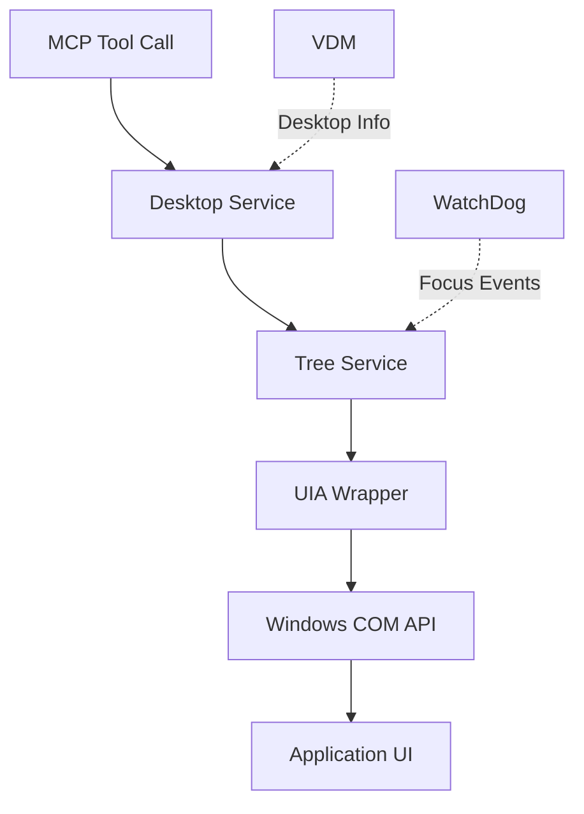

## Introduction

Windows-MCP follows a **layered service architecture** that provides a clean separation of concerns between high-level automation orchestration, UI element discovery, and low-level Windows COM API interactions.


## Architectural Layers

The system is organized into four primary layers:

<CardGroup cols={2}>
  <Card title="Entry Point Layer" icon="door-open">
    MCP server initialization and tool registration via FastMCP
  </Card>
  <Card title="Service Layer" icon="gears">
    Desktop and Tree services for high-level automation
  </Card>
  <Card title="Wrapper Layer" icon="box">
    UIAutomation COM API abstraction (uia/)
  </Card>
  <Card title="System Layer" icon="windows">
    Windows UIAutomation COM interfaces
  </Card>
</CardGroup>

## Core Components

### Entry Point (__main__.py)

The entry point initializes the MCP server and registers all 15 tools:

```python src/windows_mcp/__main__.py
mcp = FastMCP(name="windows-mcp", instructions=instructions, lifespan=lifespan)

@asynccontextmanager
async def lifespan(app: FastMCP):
    global desktop, watchdog, analytics
    desktop = Desktop()
    watchdog = WatchDog()
    watchdog.set_focus_callback(desktop.tree.on_focus_change)
    watchdog.start()
    yield
    watchdog.stop()
```

**Key Responsibilities:**
- Register 15 MCP tools (App, Shell, Snapshot, Click, Type, etc.)
- Initialize Desktop, WatchDog, and Analytics services
- Wrap tools with `@with_analytics` decorator for telemetry
- Delegate tool function calls to Desktop methods

### Desktop Service

The high-level orchestrator for all automation operations:

<Card title="Desktop Service" icon="desktop">
  Manages window operations, screenshots, mouse/keyboard actions, and clipboard. Interfaces with Tree service for UI element discovery.
</Card>

[Learn more about Desktop Service →](/architecture/desktop-service)

### Tree Service

Captures the Windows accessibility tree:

<Card title="Tree Service" icon="sitemap">
  Identifies interactive elements and scrollable areas from active and background windows. Uses multi-threaded traversal for performance.
</Card>

[Learn more about Tree Service →](/architecture/tree-service)

### UIAutomation Wrapper

Low-level abstraction over Windows COM APIs:

<Card title="UIA Wrapper" icon="layer-group">
  Wraps the Windows UIAutomation COM API via comtypes, providing Pythonic interfaces for controls, patterns, and events.
</Card>

[Learn more about UIA Wrapper →](/architecture/uia-wrapper)

## Supporting Services

### WatchDog Service

<Card title="WatchDog" icon="eye">
  Runs in a separate thread monitoring UI focus changes via UIAutomation events. Notifies the Tree service to keep the accessibility tree current.
</Card>

**Implementation:**
```python
def set_focus_callback(self, callback):
    self.focus_callback = callback
    
def on_focus_change(self, sender):
    if self.focus_callback:
        self.focus_callback(sender)
```

### Virtual Desktop Manager

<Card title="VDM" icon="layer-group">
  Tracks which windows belong to which Windows virtual desktop (Win10/11). Uses COM interfaces to query desktop assignments.
</Card>

### Analytics Service

<Card title="Analytics" icon="chart-line">
  Optional PostHog telemetry (disabled with `ANONYMIZED_TELEMETRY=false`). Tracks tool names and errors only, not arguments or outputs.
</Card>

## Data Flow



### Example: Snapshot Tool Flow

1. **MCP Client** calls `Snapshot` tool
2. **__main__.py** delegates to `desktop.get_state()`
3. **Desktop Service** captures screenshot and calls `tree.get_state()`
4. **Tree Service** traverses UI tree using multi-threading
5. **UIA Wrapper** provides Control objects from COM elements
6. **Windows COM** returns IUIAutomationElement interfaces
7. **Response** returns DesktopState with screenshot and UI elements

## Key Design Decisions

<AccordionGroup>
  <Accordion title="DPI Awareness">
    Mouse/keyboard input uses UIA coordinates (same coordinate space as BoundingRectangle) to avoid DPI mismatch issues. The wrapper sets process DPI awareness at module load:
    
    ```python
    SetProcessDpiAwareness(ProcessDpiAwareness.PerMonitorDpiAware)
    ```
  </Accordion>
  
  <Accordion title="Screenshot Optimization">
    Screenshots are capped to 1920x1080 for token efficiency when sending to LLMs:
    
    ```python
    MAX_IMAGE_WIDTH, MAX_IMAGE_HEIGHT = 1920, 1080
    ```
  </Accordion>
  
  <Accordion title="Browser Detection">
    Browser detection (Chrome, Edge, Firefox) triggers special DOM extraction mode in Snapshot:
    
    ```python
    def is_window_browser(self, node: uia.Control):
        process = Process(node.ProcessId)
        return Browser.has_process(process.name())
    ```
  </Accordion>
  
  <Accordion title="Retry Logic">
    UI element fetching has retry logic to handle transient failures:
    
    ```python
    THREAD_MAX_RETRIES = 3  # in tree/config.py
    ```
  </Accordion>
  
  <Accordion title="Fuzzy Matching">
    Fuzzy string matching (`thefuzz`) is used for element name matching to handle variations in window titles and element names.
  </Accordion>
</AccordionGroup>

## Security Context

<Warning>
  This server has **full system access** with no sandboxing. Tools like Shell and App can perform irreversible operations. The recommended deployment target is a VM or Windows Sandbox.
</Warning>

## Transport Support

Windows-MCP supports three transport mechanisms:

<CardGroup cols={3}>
  <Card title="stdio" icon="terminal">
    Standard input/output for local integration
  </Card>
  <Card title="SSE" icon="server">
    Server-Sent Events for web clients
  </Card>
  <Card title="HTTP" icon="globe">
    Streamable HTTP for remote access
  </Card>
</CardGroup>

## Next Steps

<CardGroup cols={3}>
  <Card title="Desktop Service" icon="desktop" href="/architecture/desktop-service">
    Deep dive into window operations and automation
  </Card>
  <Card title="Tree Service" icon="sitemap" href="/architecture/tree-service">
    Learn about UI tree traversal algorithms
  </Card>
  <Card title="UIA Wrapper" icon="layer-group" href="/architecture/uia-wrapper">
    Explore the COM API abstraction layer
  </Card>
</CardGroup>
