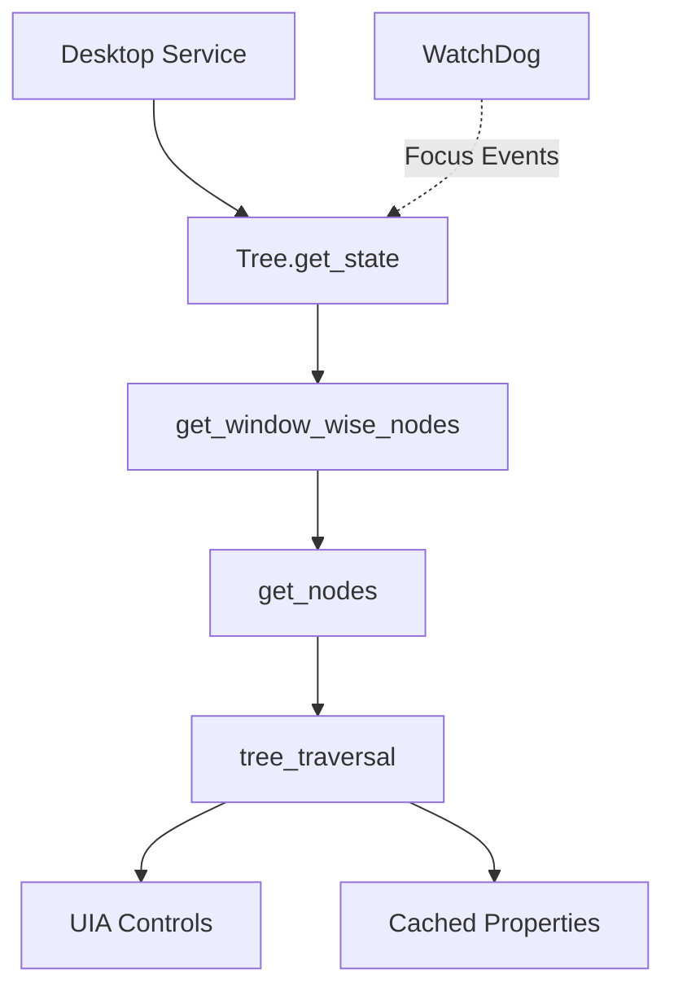

## Overview

The **Tree Service** (`tree/service.py`) is responsible for capturing the Windows accessibility tree from active and background windows. It identifies interactive elements (buttons, text fields, etc.) and scrollable areas, providing the foundation for UI automation.

<Card title="Location" icon="folder">
  `src/windows_mcp/tree/service.py` (629 lines)
</Card>

## Architecture



## Core Responsibilities

<CardGroup cols={2}>
  <Card title="Tree Traversal" icon="diagram-project">
    Recursively walk the UIAutomation tree to find all UI elements
  </Card>
  <Card title="Element Classification" icon="filter">
    Identify interactive, scrollable, and informative elements
  </Card>
  <Card title="DOM Extraction" icon="globe">
    Special handling for browser DOM content
  </Card>
  <Card title="Caching" icon="database">
    Use UIAutomation caching for performance
  </Card>
</CardGroup>

## Key Classes

### Tree Service

```python src/windows_mcp/tree/service.py
class Tree:
    def __init__(self, desktop: 'Desktop'):
        self.desktop = weakref.proxy(desktop)
        self.screen_size = desktop.get_screen_size()
        self.dom: Optional[Control] = None
        self.dom_bounding_box: BoundingBox = None
        self.screen_box = BoundingBox(
            top=0, left=0, 
            bottom=self.screen_size.height, 
            right=self.screen_size.width,
            width=self.screen_size.width, 
            height=self.screen_size.height
        )
```

## Main Workflow

### 1. State Capture Entry Point

```python src/windows_mcp/tree/service.py
def get_state(
    self,
    active_window_handle: int | None,
    other_windows_handles: list[int],
    use_dom: bool = False
) -> TreeState:
    # Reset DOM state to prevent leaks
    self.dom = None
    self.dom_bounding_box = None
    
    # Combine active and background windows
    if active_window_handle:
        windows_handles = [active_window_handle] + other_windows_handles
        active_window_flag = True
    else:
        windows_handles = other_windows_handles
        active_window_flag = False
    
    # Process all windows
    interactive_nodes, scrollable_nodes, dom_informative_nodes, failed_handles = \
        self.get_window_wise_nodes(
            windows_handles=windows_handles,
            active_window_flag=active_window_flag,
            use_dom=use_dom
        )
    
    # Build TreeState response
    return TreeState(
        status=len(failed_handles) == 0,
        root_node=...,
        dom_node=...,
        interactive_nodes=interactive_nodes,
        scrollable_nodes=scrollable_nodes,
        dom_informative_nodes=dom_informative_nodes
    )
```

### 2. Window-wise Processing

```python src/windows_mcp/tree/service.py
def get_window_wise_nodes(
    self,
    windows_handles: list[int],
    active_window_flag: bool,
    use_dom: bool = False
) -> tuple[list[TreeElementNode], list[ScrollElementNode], list[TextElementNode], list[int]]:
    interactive_nodes, scrollable_nodes, dom_informative_nodes = [], [], []
    failed_handles = []
    
    # Process windows sequentially to avoid COM threading issues
    for handle in windows_handles:
        is_browser = False
        try:
            temp_node = ControlFromHandle(handle)
            is_browser = self.desktop.is_window_browser(temp_node)
        except Exception:
            pass
        
        # Retry logic for transient failures
        for attempt in range(THREAD_MAX_RETRIES + 1):
            try:
                result = self.get_nodes(
                    handle, 
                    is_browser, 
                    wait_time=0.5 * (2 ** (attempt - 1)) if attempt > 0 else 0,
                    use_dom=use_dom
                )
                if result:
                    element_nodes, scroll_nodes, info_nodes = result
                    interactive_nodes.extend(element_nodes)
                    scrollable_nodes.extend(scroll_nodes)
                    dom_informative_nodes.extend(info_nodes)
                break
            except Exception as e:
                if attempt < THREAD_MAX_RETRIES:
                    wait_time = 0.5 * (2 ** attempt)
                    sleep(wait_time)
                else:
                    failed_handles.append(handle)
                    break
    
    return interactive_nodes, scrollable_nodes, dom_informative_nodes, failed_handles
```

<Note>
  **Why Sequential Processing?** UIAutomation requires STA (Single-Threaded Apartment). Using ThreadPoolExecutor with worker threads causes cross-apartment marshaling deadlocks. Sequential processing keeps all UIA COM calls in the main thread's STA.
</Note>

### 3. Tree Traversal Algorithm

The core traversal algorithm recursively walks the UI tree:

```python src/windows_mcp/tree/service.py
def tree_traversal(
    self,
    node: Control,
    window_bounding_box: Rect,
    window_name: str,
    is_browser: bool,
    interactive_nodes: list[TreeElementNode] = None,
    scrollable_nodes: list[ScrollElementNode] = None,
    dom_interactive_nodes: list[TreeElementNode] = None,
    dom_informative_nodes: list[TextElementNode] = None,
    is_dom: bool = False,
    is_dialog: bool = False,
    element_cache_req = None,
    children_cache_req = None,
):
    # Build cached control if caching is enabled
    if not hasattr(node, '_is_cached') and element_cache_req:
        node = CachedControlHelper.build_cached_control(node, element_cache_req)
    
    # ========== Phase 1: Scrollable Check ==========
    if scrollable_nodes is not None:
        is_offscreen = node.CachedIsOffscreen
        control_type_name = node.CachedControlTypeName
        
        if control_type_name not in (INTERACTIVE_CONTROL_TYPE_NAMES | INFORMATIVE_CONTROL_TYPE_NAMES):
            try:
                scroll_pattern = node.GetCachedPattern(PatternId.ScrollPattern, True)
                if scroll_pattern and scroll_pattern.VerticallyScrollable:
                    # Add to scrollable nodes
                    scrollable_nodes.append(ScrollElementNode(...))
            except Exception:
                pass
    
    # ========== Phase 2: Interactive & Informative Checks ==========
    element_bounding_box = node.CachedBoundingRectangle
    width = element_bounding_box.width()
    height = element_bounding_box.height()
    area = width * height
    
    # Visibility check
    is_visible = (area > 0) and (not is_offscreen or control_type_name == "EditControl")
    
    if is_visible and node.CachedIsEnabled:
        # Determine if keyboard focusable
        if control_type_name in {'EditControl', 'ButtonControl', 'CheckBoxControl', ...}:
            is_keyboard_focusable = True
        else:
            is_keyboard_focusable = node.CachedIsKeyboardFocusable
        
        # Interactive element detection
        if interactive_nodes is not None:
            is_interactive = False
            
            if control_type_name in (INTERACTIVE_CONTROL_TYPE_NAMES | DOCUMENT_CONTROL_TYPE_NAMES):
                # Check accessible role
                role = node.GetCachedPropertyValue(PropertyId.LegacyIAccessibleRoleProperty)
                is_role_interactive = AccessibleRoleNames.get(role) in INTERACTIVE_ROLES
                
                if is_role_interactive:
                    is_interactive = True
            
            if is_interactive:
                # Extract metadata (focus state, shortcuts, values, etc.)
                metadata = {'has_focused': node.CachedHasKeyboardFocus}
                
                if isinstance(node, EditControl):
                    value = node.GetCachedPropertyValue(PropertyId.LegacyIAccessibleValueProperty)
                    metadata['value'] = value.strip() if value else '(empty)'
                
                # Add to interactive nodes
                if is_browser and is_dom:
                    dom_interactive_nodes.append(TreeElementNode(...))
                else:
                    interactive_nodes.append(TreeElementNode(...))
        
        # Informative element detection (text, headings)
        if dom_informative_nodes is not None and control_type_name in INFORMATIVE_CONTROL_TYPE_NAMES:
            dom_informative_nodes.append(TextElementNode(text=node.CachedName.strip()))
    
    # ========== Phase 3: Recursive Traversal ==========
    children = CachedControlHelper.get_cached_children(node, children_cache_req)
    
    # Traverse children (right-to-left for normal apps, left-to-right for DOM)
    for child in (children if is_dom else reversed(children)):
        # Special handling for DOM root
        if is_browser and child.CachedAutomationId == "RootWebArea":
            self.dom = child
            self.dom_bounding_box = BoundingBox(...)
            self.tree_traversal(child, ..., is_dom=True, ...)  # Enter DOM subtree
        
        # Special handling for dialogs
        elif isinstance(child, WindowControl):
            if child.CachedIsOffscreen:
                continue
            is_modal = child.GetCachedPropertyValue(PropertyId.WindowIsModalProperty)
            if is_modal:
                interactive_nodes.clear()  # Modal dialog overrides previous elements
            self.tree_traversal(child, ..., is_dialog=True, ...)
        
        # Normal child
        else:
            self.tree_traversal(child, ..., is_dom=is_dom, is_dialog=is_dialog, ...)
```

<Accordion title="Traversal Algorithm Details">
  **Phase 1: Scrollable Detection**
  - Check if element has ScrollPattern
  - Verify it's vertically scrollable
  - Extract scroll percentage and metadata
  
  **Phase 2: Element Classification**
  - **Visibility**: Area > 0 and not offscreen
  - **Interactive**: Check control type, role, and focusability
  - **Informative**: Text elements for DOM extraction
  
  **Phase 3: Recursive Traversal**
  - **Normal apps**: Right-to-left traversal (reverse children)
  - **Browser DOM**: Left-to-right traversal (natural order)
  - **Special cases**: Dialog windows, DOM roots
</Accordion>

## Caching Strategy

The Tree service uses UIAutomation caching to minimize COM calls:

```python src/windows_mcp/tree/cache_utils.py
class CacheRequestFactory:
    @staticmethod
    def create_tree_traversal_cache():
        cache_request = CacheRequest()
        
        # Cache commonly used properties
        cache_request.AddProperty(PropertyId.NameProperty)
        cache_request.AddProperty(PropertyId.ControlTypeProperty)
        cache_request.AddProperty(PropertyId.ClassNameProperty)
        cache_request.AddProperty(PropertyId.AutomationIdProperty)
        cache_request.AddProperty(PropertyId.BoundingRectangleProperty)
        cache_request.AddProperty(PropertyId.IsEnabledProperty)
        cache_request.AddProperty(PropertyId.IsOffscreenProperty)
        cache_request.AddProperty(PropertyId.IsKeyboardFocusableProperty)
        cache_request.AddProperty(PropertyId.HasKeyboardFocusProperty)
        
        # Cache patterns
        cache_request.AddPattern(PatternId.ScrollPattern)
        cache_request.AddPattern(PatternId.ValuePattern)
        cache_request.AddPattern(PatternId.TogglePattern)
        
        return cache_request
```

<Info>
  Caching reduces round-trip COM calls from **~15 calls per element** to **1-2 calls**, improving traversal speed by 10-15x.
</Info>

## Element Classification

The Tree service categorizes UI elements into three types:

### Interactive Elements

Elements that can be clicked, typed into, or otherwise interacted with:

```python src/windows_mcp/tree/config.py
INTERACTIVE_CONTROL_TYPE_NAMES = {
    'ButtonControl',
    'EditControl',
    'HyperlinkControl',
    'CheckBoxControl',
    'RadioButtonControl',
    'ComboBoxControl',
    'ListItemControl',
    'TabItemControl',
    'MenuItemControl',
    'DataItemControl',
    'TreeItemControl',
}
```

### Scrollable Elements

Elements that support scrolling:

```python
if scroll_pattern and scroll_pattern.VerticallyScrollable:
    metadata = {
        'horizontal_scrollable': scroll_pattern.HorizontallyScrollable,
        'horizontal_scroll_percent': scroll_pattern.HorizontalScrollPercent,
        'vertical_scrollable': scroll_pattern.VerticallyScrollable,
        'vertical_scroll_percent': scroll_pattern.VerticalScrollPercent,
    }
    scrollable_nodes.append(ScrollElementNode(...))
```

### Informative Elements

Text and heading elements for content extraction:

```python src/windows_mcp/tree/config.py
INFORMATIVE_CONTROL_TYPE_NAMES = {
    'TextControl',
    'HeaderControl',
    'HeaderItemControl',
}
```

## Browser DOM Handling

The Tree service has special logic for extracting browser DOM content:

```python
if is_browser and child.CachedAutomationId == "RootWebArea":
    # Store DOM bounding box
    bounding_box = child.CachedBoundingRectangle
    self.dom_bounding_box = BoundingBox(
        left=bounding_box.left,
        top=bounding_box.top,
        right=bounding_box.right,
        bottom=bounding_box.bottom,
        width=bounding_box.width(),
        height=bounding_box.height()
    )
    self.dom = child
    
    # Enter DOM subtree with left-to-right traversal
    self.tree_traversal(
        child,
        window_bounding_box,
        window_name,
        is_browser,
        interactive_nodes,
        scrollable_nodes,
        dom_interactive_nodes,
        dom_informative_nodes,
        is_dom=True,  # Enable DOM mode
        is_dialog=is_dialog,
        element_cache_req=element_cache_req,
        children_cache_req=children_cache_req
    )
```

<Card title="DOM Extraction" icon="globe">
  When `use_dom=True`, the Tree service extracts **DOM interactive nodes** and **informative text nodes** instead of browser UI elements, enabling web page automation.
</Card>

## Data Models

The Tree service returns data via models defined in `tree/views.py`:

```python
@dataclass
class TreeState:
    status: bool  # True if all windows captured successfully
    root_node: TreeElementNode
    dom_node: ScrollElementNode | None
    interactive_nodes: list[TreeElementNode]
    scrollable_nodes: list[ScrollElementNode]
    dom_informative_nodes: list[TextElementNode]

@dataclass
class TreeElementNode:
    name: str
    control_type: str
    bounding_box: BoundingBox
    center: Center
    window_name: str
    metadata: dict[str, Any]

@dataclass
class ScrollElementNode(TreeElementNode):
    @property
    def vertical_scroll_percent(self) -> float:
        return self.metadata.get('vertical_scroll_percent', 0)
```

## Performance Optimizations

<CardGroup cols={2}>
  <Card title="Caching" icon="database">
    Use UIAutomation caching to reduce COM round-trips by 10-15x
  </Card>
  <Card title="Retry Logic" icon="rotate">
    Retry failed windows up to 3 times with exponential backoff
  </Card>
  <Card title="Sequential Processing" icon="list">
    Avoid COM threading deadlocks by processing windows sequentially
  </Card>
  <Card title="Early Termination" icon="stop">
    Skip offscreen and invisible elements early in traversal
  </Card>
</CardGroup>

## Focus Event Handling

The WatchDog service calls `on_focus_change()` when UI focus changes:

```python src/windows_mcp/tree/service.py
def on_focus_change(self, sender):
    # Debounce duplicate events
    current_time = perf_counter()
    element = Control.CreateControlFromElement(sender)
    runtime_id = element.GetRuntimeId()
    event_key = tuple(runtime_id)
    
    if hasattr(self, '_last_focus_event') and self._last_focus_event:
        last_key, last_time = self._last_focus_event
        if last_key == event_key and (current_time - last_time) < 1.0:
            return None  # Duplicate event, ignore
    
    self._last_focus_event = (event_key, current_time)
    logger.debug(f"Focus changed to: '{element.Name}' ({element.ControlTypeName})")
```

## Error Handling

The Tree service implements robust error handling:

```python
for attempt in range(THREAD_MAX_RETRIES + 1):
    try:
        result = self.get_nodes(handle, is_browser, wait_time=...)
        if result:
            # Success - extend node lists
            break
    except Exception as e:
        if attempt < THREAD_MAX_RETRIES:
            wait_time = 0.5 * (2 ** attempt)
            logger.warning(f"Retry {attempt+1}/{THREAD_MAX_RETRIES} in {wait_time}s")
            sleep(wait_time)
        else:
            logger.error(f"Failed after {THREAD_MAX_RETRIES} retries")
            failed_handles.append(handle)
```

<Note>
  The retry logic uses **exponential backoff** (0.5s, 1.0s, 2.0s) to handle transient COM errors.
</Note>

## Next Steps

<CardGroup cols={2}>
  <Card title="UIA Wrapper" icon="layer-group" href="/architecture/uia-wrapper">
    Learn about the low-level COM API wrapper
  </Card>
  <Card title="Desktop Service" icon="desktop" href="/architecture/desktop-service">
    See how Desktop service uses Tree service
  </Card>
</CardGroup>
