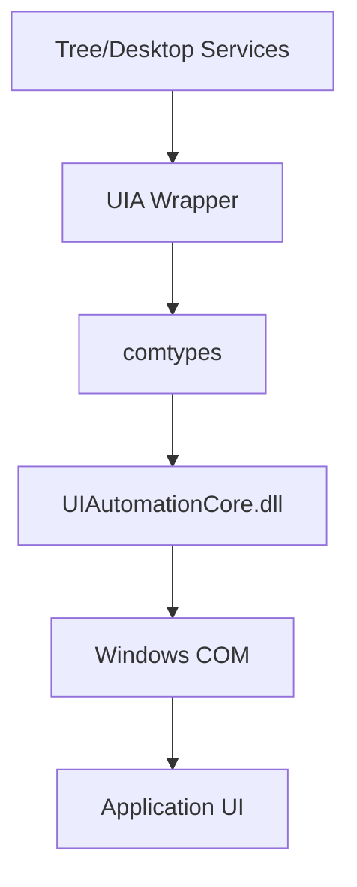

## Overview

The **UIAutomation Wrapper** (`uia/` directory) provides a Pythonic abstraction layer over the Windows UIAutomation COM API. It uses `comtypes` to interface with Windows COM objects and exposes them as Python classes and functions.

<Card title="Location" icon="folder">
  `src/windows_mcp/uia/` directory
</Card>

## Architecture



## Module Structure

<CardGroup cols={2}>
  <Card title="core.py" icon="cube">
    Core automation client, mouse/keyboard input, window management
  </Card>
  <Card title="controls.py" icon="squares">
    Control class and specialized control types (Button, Edit, etc.)
  </Card>
  <Card title="patterns.py" icon="pattern">
    UIAutomation pattern wrappers (Scroll, Value, Toggle, etc.)
  </Card>
  <Card title="enums.py" icon="list-ol">
    Enumerations for control types, patterns, properties
  </Card>
  <Card title="events.py" icon="bell">
    Event subscription and handling
  </Card>
  <Card title="__init__.py" icon="file">
    Public API exports
  </Card>
</CardGroup>

## Core Components

### Automation Client

The `_AutomationClient` singleton initializes the COM interface:

```python src/windows_mcp/uia/core.py
class _AutomationClient:
    _instance = None
    
    @classmethod
    def instance(cls) -> "_AutomationClient":
        """Singleton instance (prevents COM creation on import)."""
        if cls._instance is None:
            cls._instance = cls()
        return cls._instance
    
    def __init__(self):
        # Initialize COM
        ctypes.windll.ole32.CoInitialize(None)
        
        # Load UIAutomation COM module
        self.UIAutomationCore = comtypes.client.GetModule("UIAutomationCore.dll")
        
        # Create IUIAutomation instance
        self.IUIAutomation = comtypes.client.CreateObject(
            "{ff48dba4-60ef-4201-aa87-54103eef594e}",
            interface=self.UIAutomationCore.IUIAutomation,
        )
        
        # Get tree walker
        self.ViewWalker = self.IUIAutomation.RawViewWalker
```

<Info>
  The singleton pattern ensures only one COM instance is created, preventing resource leaks and threading issues.
</Info>

### DPI Awareness

Critical for correct coordinate mapping on scaled displays:

```python src/windows_mcp/uia/core.py
def SetProcessDpiAwareness(dpiAwareness: int):
    """
    Set process DPI awareness so UIA coordinates (BoundingRectangle, Click, MoveTo)
    use physical pixels consistently.
    """
    try:
        # Windows 8.1+ API
        return ctypes.windll.shcore.SetProcessDpiAwareness(dpiAwareness)
    except Exception:
        try:
            # Fallback for Windows 7
            ctypes.windll.user32.SetProcessDPIAware()
        except Exception:
            pass

# Set DPI awareness at module load (before any UIA calls)
SetProcessDpiAwareness(ProcessDpiAwareness.PerMonitorDpiAware)
```

<Warning>
  DPI awareness **must be set before any UIA calls**. Without it, coordinates on scaled displays (125%, 150%, etc.) will be incorrect.
</Warning>

## Mouse & Keyboard Input

### Mouse Operations

```python src/windows_mcp/uia/core.py
def Click(x: int, y: int, waitTime: float = OPERATION_WAIT_TIME) -> None:
    """Simulate mouse click at point x, y."""
    SetCursorPos(x, y)
    screenWidth, screenHeight = GetScreenSize()
    
    # Left button down
    mouse_event(
        MouseEventFlag.LeftDown | MouseEventFlag.Absolute,
        x * 65535 // screenWidth,
        y * 65535 // screenHeight,
        0, 0
    )
    time.sleep(0.05)
    
    # Left button up
    mouse_event(
        MouseEventFlag.LeftUp | MouseEventFlag.Absolute,
        x * 65535 // screenWidth,
        y * 65535 // screenHeight,
        0, 0
    )
    time.sleep(waitTime)

def RightClick(x: int, y: int, waitTime: float = OPERATION_WAIT_TIME) -> None:
    """Simulate right click."""
    # Similar implementation with MouseEventFlag.RightDown/RightUp

def MoveTo(x: int, y: int, moveSpeed: float = 1, waitTime: float = OPERATION_WAIT_TIME) -> None:
    """Simulate smooth mouse movement."""
    curX, curY = GetCursorPos()
    xCount = abs(x - curX)
    yCount = abs(y - curY)
    maxPoint = max(xCount, yCount)
    
    # Calculate step count for smooth movement
    stepCount = maxPoint // 20
    if stepCount > 1:
        xStep = (x - curX) / stepCount
        yStep = (y - curY) / stepCount
        interval = (MAX_MOVE_SECOND / moveSpeed) / stepCount
        
        for i in range(stepCount):
            cx = curX + int(xStep * i)
            cy = curY + int(yStep * i)
            SetCursorPos(cx, cy)
            time.sleep(interval)
    
    SetCursorPos(x, y)
    time.sleep(waitTime)
```

### Keyboard Input

The `SendKeys` function provides rich keyboard automation:

```python src/windows_mcp/uia/core.py
def SendKeys(
    text: str,
    interval: float = 0.01,
    waitTime: float = OPERATION_WAIT_TIME,
    charMode: bool = True,
    debug: bool = False,
) -> None:
    """
    Simulate typing keys on keyboard.
    
    Examples:
    SendKeys('{Ctrl}a{Delete}')  # Ctrl+A, Delete
    SendKeys('{Ctrl}(AB)')       # Ctrl+A+B simultaneously
    SendKeys('{a 3}')            # Type 'a' 3 times
    SendKeys('Hello{Enter}')     # Type 'Hello' and press Enter
    """
    # Parse text into key events
    # Handle special keys: {Ctrl}, {Shift}, {Enter}, etc.
    # Handle modifiers: (AB) means hold previous modifier
    # Handle repeats: {a 3} means press 'a' 3 times
    ...
```

<Accordion title="SendKeys Syntax">
  **Special Keys:**
  - `{Ctrl}`, `{Shift}`, `{Alt}`, `{Win}` - Modifier keys
  - `{Enter}`, `{Tab}`, `{Esc}` - Special keys
  - `{Up}`, `{Down}`, `{Left}`, `{Right}` - Arrow keys
  - `{Home}`, `{End}`, `{PageUp}`, `{PageDown}` - Navigation
  
  **Modifiers:**
  - `{Ctrl}a` - Press Ctrl+A
  - `{Ctrl}(AB)` - Hold Ctrl, press A+B, release Ctrl
  
  **Repeats:**
  - `{a 3}` - Press 'a' three times
  - `{Enter 2}` - Press Enter twice
  
  **Escaping:**
  - Type opening brace: `{{` followed by `}}`
  - Type closing brace: `{}` followed by `}}`
</Accordion>

## Control Wrapper

The `Control` class wraps `IUIAutomationElement`:

```python src/windows_mcp/uia/controls.py
class Control:
    def __init__(
        self,
        searchFromControl: "Control" | None = None,
        searchDepth: int = 0xFFFFFFFF,
        searchInterval: float = SEARCH_INTERVAL,
        foundIndex: int = 1,
        element=None,
        ControlType: int | None = None,
        Name: str | None = None,
        ClassName: str | None = None,
        AutomationId: str | None = None,
        **searchProperties,
    ):
        self._element = element
        self.searchFromControl = searchFromControl
        self.searchDepth = searchDepth
        self.searchProperties = searchProperties
    
    @property
    def Element(self):
        """Return ctypes.POINTER(IUIAutomationElement)."""
        if not self._element:
            self.Refind(maxSearchSeconds=TIME_OUT_SECOND)
        return self._element
    
    @property
    def BoundingRectangle(self) -> Rect:
        """Get element's bounding rectangle."""
        rect = self.Element.CurrentBoundingRectangle
        return Rect(rect.left, rect.top, rect.right, rect.bottom)
    
    @property
    def Name(self) -> str:
        """Get element's name."""
        return self.Element.CurrentName or ""
    
    @property
    def ControlType(self) -> int:
        """Get element's control type."""
        return self.Element.CurrentControlType
    
    def GetFirstChildControl(self) -> "Control" | None:
        """Get first child in tree."""
        ele = _AutomationClient.instance().ViewWalker.GetFirstChildElement(self.Element)
        return Control.CreateControlFromElement(ele)
    
    def GetNextSiblingControl(self) -> "Control" | None:
        """Get next sibling in tree."""
        ele = _AutomationClient.instance().ViewWalker.GetNextSiblingElement(self.Element)
        return Control.CreateControlFromElement(ele)
    
    def GetParentControl(self) -> "Control" | None:
        """Get parent in tree."""
        ele = _AutomationClient.instance().ViewWalker.GetParentElement(self.Element)
        return Control.CreateControlFromElement(ele)
```

### Specialized Control Types

```python
class ButtonControl(Control):
    def __init__(self, **kwargs):
        super().__init__(ControlType=ControlType.ButtonControl, **kwargs)

class EditControl(Control):
    def __init__(self, **kwargs):
        super().__init__(ControlType=ControlType.EditControl, **kwargs)

class CheckBoxControl(Control):
    def __init__(self, **kwargs):
        super().__init__(ControlType=ControlType.CheckBoxControl, **kwargs)

class ComboBoxControl(Control):
    def __init__(self, **kwargs):
        super().__init__(ControlType=ControlType.ComboBoxControl, **kwargs)

class WindowControl(Control):
    def __init__(self, **kwargs):
        super().__init__(ControlType=ControlType.WindowControl, **kwargs)
```

## Caching Support

The wrapper supports UIAutomation caching for performance:

```python src/windows_mcp/uia/controls.py
class Control:
    @property
    def CachedName(self) -> str:
        """Get cached name."""
        return self.Element.CachedName
    
    @property
    def CachedBoundingRectangle(self) -> Rect:
        """Get cached bounding rectangle."""
        rect = self.Element.CachedBoundingRectangle
        return Rect(rect.left, rect.top, rect.right, rect.bottom)
    
    @property
    def CachedIsEnabled(self) -> bool:
        """Get cached IsEnabled property."""
        return self.Element.CachedIsEnabled
    
    def GetCachedChildren(self) -> List["Control"]:
        """Retrieve cached child elements."""
        try:
            elementArray = self.Element.GetCachedChildren()
            if not elementArray:
                return []
            
            controls = []
            for i in range(elementArray.Length):
                element = elementArray.GetElement(i)
                control = Control.CreateControlFromElement(element)
                if control:
                    controls.append(control)
            return controls
        except comtypes.COMError:
            return []
    
    def GetCachedPattern(self, patternId: int, cache: bool):
        """Get cached pattern."""
        if cache:
            pattern = self._supportedPatterns.get(patternId)
            if pattern:
                return pattern
        
        pattern = self.GetPattern(patternId)
        if pattern:
            self._supportedPatterns[patternId] = pattern
        return pattern
```

## Pattern Wrappers

Patterns provide access to control-specific functionality:

```python src/windows_mcp/uia/patterns.py
class ScrollPattern:
    def __init__(self, pattern):
        self._pattern = pattern
    
    @property
    def HorizontallyScrollable(self) -> bool:
        return self._pattern.CurrentHorizontallyScrollable
    
    @property
    def VerticallyScrollable(self) -> bool:
        return self._pattern.CurrentVerticallyScrollable
    
    @property
    def HorizontalScrollPercent(self) -> float:
        return self._pattern.CurrentHorizontalScrollPercent
    
    @property
    def VerticalScrollPercent(self) -> float:
        return self._pattern.CurrentVerticalScrollPercent
    
    def Scroll(self, horizontalAmount, verticalAmount):
        self._pattern.Scroll(horizontalAmount, verticalAmount)

class ValuePattern:
    def __init__(self, pattern):
        self._pattern = pattern
    
    @property
    def Value(self) -> str:
        return self._pattern.CurrentValue
    
    @property
    def IsReadOnly(self) -> bool:
        return self._pattern.CurrentIsReadOnly
    
    def SetValue(self, value: str):
        self._pattern.SetValue(value)

class TogglePattern:
    def __init__(self, pattern):
        self._pattern = pattern
    
    @property
    def ToggleState(self) -> int:
        return self._pattern.CurrentToggleState
    
    def Toggle(self):
        self._pattern.Toggle()
```

## Utility Functions

### Screen & Monitor

```python src/windows_mcp/uia/core.py
def GetScreenSize() -> Tuple[int, int]:
    """Return (width, height) of primary screen."""
    w = ctypes.windll.user32.GetSystemMetrics(0)  # SM_CXSCREEN
    h = ctypes.windll.user32.GetSystemMetrics(1)  # SM_CYSCREEN
    return w, h

def GetVirtualScreenSize() -> Tuple[int, int]:
    """Return (width, height) of virtual screen (all monitors)."""
    w = ctypes.windll.user32.GetSystemMetrics(78)  # SM_CXVIRTUALSCREEN
    h = ctypes.windll.user32.GetSystemMetrics(79)  # SM_CYVIRTUALSCREEN
    return w, h

def GetVirtualScreenRect() -> Tuple[int, int, int, int]:
    """Return (left, top, width, height) of virtual screen."""
    return (
        ctypes.windll.user32.GetSystemMetrics(76),  # SM_XVIRTUALSCREEN
        ctypes.windll.user32.GetSystemMetrics(77),  # SM_YVIRTUALSCREEN
        ctypes.windll.user32.GetSystemMetrics(78),  # SM_CXVIRTUALSCREEN
        ctypes.windll.user32.GetSystemMetrics(79),  # SM_CYVIRTUALSCREEN
    )

def GetMonitorsRect() -> List[Rect]:
    """Get list of monitor rectangles."""
    rects = []
    
    def MonitorCallback(hMonitor, hdcMonitor, lprcMonitor, dwData):
        rect = Rect(
            lprcMonitor.contents.left,
            lprcMonitor.contents.top,
            lprcMonitor.contents.right,
            lprcMonitor.contents.bottom,
        )
        rects.append(rect)
        return 1
    
    ctypes.windll.user32.EnumDisplayMonitors(
        None, None, MonitorEnumProc(MonitorCallback), 0
    )
    return rects
```

### Window Management

```python src/windows_mcp/uia/core.py
def GetForegroundWindow() -> int:
    """Get handle of foreground window."""
    return ctypes.windll.user32.GetForegroundWindow()

def SetForegroundWindow(handle: int) -> bool:
    """Set window as foreground."""
    return bool(ctypes.windll.user32.SetForegroundWindow(handle))

def IsIconic(handle: int) -> bool:
    """Check if window is minimized."""
    return bool(ctypes.windll.user32.IsIconic(handle))

def IsZoomed(handle: int) -> bool:
    """Check if window is maximized."""
    return bool(ctypes.windll.user32.IsZoomed(handle))

def IsWindowVisible(handle: int) -> bool:
    """Check if window is visible."""
    return bool(ctypes.windll.user32.IsWindowVisible(handle))

def MoveWindow(handle: int, x: int, y: int, width: int, height: int, repaint: int = 1) -> bool:
    """Move and resize window."""
    return bool(
        ctypes.windll.user32.MoveWindow(handle, x, y, width, height, repaint)
    )
```

## Helper Classes

### Rect Class

```python src/windows_mcp/uia/core.py
class Rect:
    def __init__(self, left: int, top: int, right: int, bottom: int):
        self.left = left
        self.top = top
        self.right = right
        self.bottom = bottom
    
    def width(self) -> int:
        return self.right - self.left
    
    def height(self) -> int:
        return self.bottom - self.top
    
    def xcenter(self) -> int:
        return (self.left + self.right) // 2
    
    def ycenter(self) -> int:
        return (self.top + self.bottom) // 2
    
    def intersect(self, other: 'Rect') -> 'Rect':
        return Rect(
            max(self.left, other.left),
            max(self.top, other.top),
            min(self.right, other.right),
            min(self.bottom, other.bottom)
        )
```

## Control Discovery

```python src/windows_mcp/uia/core.py
def ControlFromHandle(handle: int) -> Control:
    """Create Control from window handle."""
    element = _AutomationClient.instance().IUIAutomation.ElementFromHandle(handle)
    return Control.CreateControlFromElement(element)

def ControlFromCursor() -> Control:
    """Create Control from element under cursor."""
    x, y = GetCursorPos()
    element = _AutomationClient.instance().IUIAutomation.ElementFromPoint(
        POINT(x, y)
    )
    return Control.CreateControlFromElement(element)

def GetRootControl() -> Control:
    """Get root (desktop) control."""
    element = _AutomationClient.instance().IUIAutomation.GetRootElement()
    return Control.CreateControlFromElement(element)
```

## Usage Example

Here's how the Tree service uses the wrapper:

```python
import windows_mcp.uia as uia

# Get control from window handle
node = uia.ControlFromHandle(window_handle)

# Check if it's a browser
if node.ClassName in ['Chrome_WidgetWin_1', 'MozillaWindowClass']:
    is_browser = True

# Access properties
name = node.CachedName
rect = node.CachedBoundingRectangle
is_enabled = node.CachedIsEnabled

# Get pattern
scroll_pattern = node.GetCachedPattern(uia.PatternId.ScrollPattern, True)
if scroll_pattern and scroll_pattern.VerticallyScrollable:
    percent = scroll_pattern.VerticalScrollPercent

# Traverse tree
children = node.GetCachedChildren()
for child in children:
    process_child(child)
```

## Best Practices

<CardGroup cols={2}>
  <Card title="Use Caching" icon="database">
    Always use cached properties when traversing to minimize COM calls
  </Card>
  <Card title="Handle COM Errors" icon="shield">
    Wrap COM calls in try/except to handle transient failures
  </Card>
  <Card title="DPI Awareness" icon="expand">
    Ensure DPI awareness is set before creating controls
  </Card>
  <Card title="Thread Safety" icon="lock">
    Keep all UIA calls in the main STA thread
  </Card>
</CardGroup>

## Next Steps

<CardGroup cols={2}>
  <Card title="Tree Service" icon="sitemap" href="/architecture/tree-service">
    See how Tree service uses the UIA wrapper
  </Card>
  <Card title="Desktop Service" icon="desktop" href="/architecture/desktop-service">
    Learn about high-level automation operations
  </Card>
</CardGroup>
