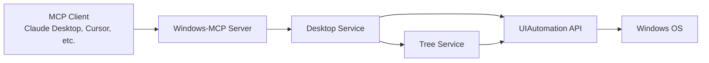

## What is MCP?

The **Model Context Protocol (MCP)** is an open protocol that standardizes how AI applications communicate with external data sources and tools. It enables Large Language Models (LLMs) to interact with various systems through a consistent interface.

Windows-MCP implements MCP as a server, exposing Windows desktop automation capabilities to any MCP-compatible client.

## MCP Architecture



### Core Components

<CardGroup cols={2}>
  <Card title="MCP Client" icon="robot">
    AI assistants like Claude Desktop, Cursor, or custom applications that consume MCP tools
  </Card>
  
  <Card title="MCP Server" icon="server">
    Windows-MCP server that exposes 15+ tools for Windows automation
  </Card>
  
  <Card title="Transport Layer" icon="tower-broadcast">
    Communication channel between client and server (stdio, SSE, or HTTP)
  </Card>
  
  <Card title="Tools" icon="wrench">
    Individual capabilities like Click, Type, Snapshot, App, Shell, etc.
  </Card>
</CardGroup>

## How Windows-MCP Implements MCP

Windows-MCP is built on **FastMCP**, a Python framework for building MCP servers. The implementation follows these principles:

### 1. Tool Registration

Each Windows automation capability is registered as an MCP tool using the `@mcp.tool()` decorator:

```python src/windows_mcp/__main__.py
@mcp.tool(
    name="Click",
    description="Performs mouse clicks at specified coordinates...",
    annotations=ToolAnnotations(
        title="Click",
        readOnlyHint=False,
        destructiveHint=True,
        idempotentHint=False,
        openWorldHint=False,
    ),
)
@with_analytics(analytics, "Click-Tool")
def click_tool(
    loc: list[int] | None = None,
    label: int | None = None,
    button: Literal["left", "right", "middle"] = "left",
    clicks: int = 1,
    ctx: Context = None,
) -> str:
    # Tool implementation delegates to Desktop service
    desktop.click(loc=loc, button=button, clicks=clicks)
    return f"{clicks} {button} clicked at ({loc[0]},{loc[1]})."
```

### 2. Service-Oriented Architecture

The server follows a layered architecture:

<Steps>
  <Step title="Entry Point">
    **`__main__.py`** registers all 15 MCP tools on a FastMCP server instance. Uses an async lifespan to initialize Desktop, WatchDog, and Analytics services.
  </Step>
  
  <Step title="Desktop Service">
    **`desktop/service.py`** is the high-level orchestrator managing window operations, screenshots, mouse/keyboard actions, and clipboard.
  </Step>
  
  <Step title="Tree Service">
    **`tree/service.py`** captures the Windows accessibility tree, identifying interactive elements and scrollable areas using multi-threaded UI traversal.
  </Step>
  
  <Step title="UIAutomation Wrapper">
    **`uia/`** provides low-level abstraction over the Windows UIAutomation COM API via comtypes.
  </Step>
</Steps>

### 3. Async Lifespan Management

Windows-MCP initializes services before the server starts:

```python src/windows_mcp/__main__.py
@asynccontextmanager
async def lifespan(app: FastMCP):
    global desktop, watchdog, analytics, screen_size
    
    # Initialize components
    if os.getenv("ANONYMIZED_TELEMETRY", "true").lower() != "false":
        analytics = PostHogAnalytics()
    desktop = Desktop()
    watchdog = WatchDog()
    screen_size = desktop.get_screen_size()
    watchdog.set_focus_callback(desktop.tree.on_focus_change)
    
    try:
        watchdog.start()
        await asyncio.sleep(1)
        yield
    finally:
        if watchdog:
            watchdog.stop()
        if analytics:
            await analytics.close()
```

## MCP Tool Categories

Windows-MCP's 15 tools are organized by functionality:

### UI Interaction Tools

<CardGroup cols={3}>
  <Card title="Click" icon="hand-pointer">
    Mouse clicks with coordinate or label targeting
  </Card>
  <Card title="Type" icon="keyboard">
    Text input with caret positioning
  </Card>
  <Card title="Move" icon="arrow-pointer">
    Cursor movement and drag operations
  </Card>
  <Card title="Scroll" icon="arrows-up-down">
    Vertical/horizontal scrolling
  </Card>
  <Card title="Shortcut" icon="command">
    Keyboard shortcuts (Ctrl+C, Alt+Tab)
  </Card>
</CardGroup>

### System Tools

<CardGroup cols={3}>
  <Card title="App" icon="window-restore">
    Launch, resize, and switch applications
  </Card>
  <Card title="PowerShell" icon="terminal">
    Execute shell commands
  </Card>
  <Card title="Process" icon="list-check">
    List and kill running processes
  </Card>
  <Card title="Registry" icon="database">
    Read/write Windows Registry
  </Card>
</CardGroup>

### Data Tools

<CardGroup cols={3}>
  <Card title="Snapshot" icon="camera">
    Capture desktop state with UI tree
  </Card>
  <Card title="Scrape" icon="globe">
    Fetch web page content
  </Card>
  <Card title="Clipboard" icon="clipboard">
    Copy/paste operations
  </Card>
  <Card title="FileSystem" icon="folder">
    File read/write/search
  </Card>
</CardGroup>

### Batch Tools

<CardGroup cols={2}>
  <Card title="MultiSelect" icon="check-double">
    Select multiple items at once
  </Card>
  <Card title="MultiEdit" icon="pen-to-square">
    Edit multiple input fields
  </Card>
</CardGroup>

## Tool Annotations

Each tool includes metadata to help MCP clients understand behavior:

```python
ToolAnnotations(
    title="Click",
    readOnlyHint=False,      # Does it modify state?
    destructiveHint=True,     # Can it cause irreversible changes?
    idempotentHint=False,     # Same result on repeated calls?
    openWorldHint=False,      # Can it access internet/external resources?
)
```

## Communication Flow

<Steps>
  <Step title="Client Request">
    MCP client sends a tool invocation request (e.g., `Click` at coordinates [100, 200])
  </Step>
  
  <Step title="Transport Layer">
    Request is transmitted via stdio, SSE, or HTTP transport
  </Step>
  
  <Step title="Tool Execution">
    Windows-MCP server receives request, validates parameters, and executes the tool
  </Step>
  
  <Step title="Desktop Integration">
    Tool delegates to Desktop service, which uses UIAutomation to interact with Windows
  </Step>
  
  <Step title="Response">
    Server returns execution result (success message or error) to client
  </Step>
</Steps>

## Error Handling

Windows-MCP implements robust error handling:

```python
try:
    desktop.click(loc=loc, button=button, clicks=clicks)
    return f"{clicks} {button} clicked at ({loc[0]},{loc[1]})."
except Exception as e:
    return f"Error executing click: {str(e)}"
```

Errors are returned as descriptive strings to help the LLM understand what went wrong and potentially retry with different parameters.

## Next Steps

<CardGroup cols={2}>
  <Card title="Operating Modes" icon="toggle-on" href="/concepts/operating-modes">
    Learn about local and remote deployment modes
  </Card>
  
  <Card title="Transport Options" icon="tower-broadcast" href="/concepts/transport-options">
    Understand stdio, SSE, and HTTP transports
  </Card>
</CardGroup>