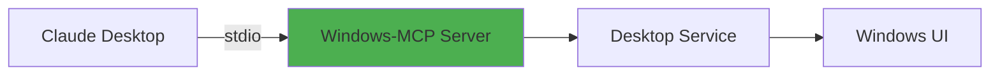

## Overview

Windows-MCP supports two operating modes to accommodate different deployment scenarios:

<CardGroup cols={2}>
  <Card title="Local Mode" icon="computer">
    Run directly on your Windows machine for personal use
  </Card>
  
  <Card title="Remote Mode" icon="cloud">
    Connect to cloud-hosted Windows VMs via windowsmcp.io
  </Card>
</CardGroup>

## Local Mode (Default)

In local mode, Windows-MCP runs directly on your Windows machine and exposes its tools to the connected MCP client.

### How It Works



The MCP client (e.g., Claude Desktop, Cursor) launches Windows-MCP as a subprocess and communicates via **stdio** (standard input/output).

### Configuration

**No environment variables needed** for local mode. Simply configure your MCP client:

<Tabs>
  <Tab title="From PyPI (Recommended)">
    ```json claude_desktop_config.json
    {
      "mcpServers": {
        "windows-mcp": {
          "command": "uvx",
          "args": ["windows-mcp"]
        }
      }
    }
    ```
  </Tab>
  
  <Tab title="From Source">
    ```json claude_desktop_config.json
    {
      "mcpServers": {
        "windows-mcp": {
          "command": "uv",
          "args": [
            "--directory",
            "C:\\path\\to\\Windows-MCP",
            "run",
            "windows-mcp"
          ]
        }
      }
    }
    ```
  </Tab>
</Tabs>

### Running with Alternative Transports

While stdio is the default for local mode, you can also run with network transports:

<CodeGroup>
```bash SSE Transport
uvx windows-mcp --transport sse --host localhost --port 8000
```

```bash HTTP Transport
uvx windows-mcp --transport streamable-http --host localhost --port 8000
```
</CodeGroup>

This is useful for:
- Testing with network-based MCP clients
- Accessing from containers or VMs on the same network
- Development and debugging scenarios

### Use Cases

<AccordionGroup>
  <Accordion title="Personal Desktop Automation" icon="house-user">
    Automate your own Windows machine for daily tasks, testing, or productivity workflows.
  </Accordion>
  
  <Accordion title="Development & Testing" icon="code">
    Test Windows applications, perform QA testing, or automate UI interactions during development.
  </Accordion>
  
  <Accordion title="Local AI Workflows" icon="robot">
    Integrate Windows automation into local AI agent workflows without cloud dependencies.
  </Accordion>
</AccordionGroup>

## Remote Mode

In remote mode, Windows-MCP acts as a **proxy** that connects to [windowsmcp.io](https://windowsmcp.io), enabling cloud-hosted Windows automation.

### How It Works


The proxy forwards MCP requests to a remote Windows VM running the actual Windows-MCP server.

### Configuration

Remote mode requires three environment variables:

<ParamField path="MODE" type="string" required>
  Set to `remote` to enable remote mode
</ParamField>

<ParamField path="SANDBOX_ID" type="string" required>
  The sandbox/VM identifier from the windowsmcp.io dashboard
</ParamField>

<ParamField path="API_KEY" type="string" required>
  Your Windows-MCP API key for authentication
</ParamField>

### Example Configuration

```json claude_desktop_config.json
{
  "mcpServers": {
    "windows-mcp": {
      "command": "uvx",
      "args": ["windows-mcp"],
      "env": {
        "MODE": "remote",
        "SANDBOX_ID": "your-sandbox-id",
        "API_KEY": "your-api-key"
      }
    }
  }
}
```

### Implementation Details

From the source code in `src/windows_mcp/__main__.py:798-816`:

```python
case Mode.REMOTE.value:
    if not config.sandbox_id:
        raise ValueError("SANDBOX_ID is required for MODE: remote")
    if not config.api_key:
        raise ValueError("API_KEY is required for MODE: remote")
    
    # Authenticate and get proxy endpoint
    client = AuthClient(api_key=config.api_key, sandbox_id=config.sandbox_id)
    client.authenticate()
    
    # Create proxy MCP server
    backend = StreamableHttpTransport(
        url=client.proxy_url,
        headers=client.proxy_headers
    )
    proxy_mcp = FastMCP.as_proxy(ProxyClient(backend), name="windows-mcp")
    
    # Run proxy with specified transport
    proxy_mcp.run(transport=transport, host=host, port=port, show_banner=False)
```

The proxy:
1. Authenticates with windowsmcp.io using your API key
2. Establishes a connection to your assigned VM sandbox
3. Forwards all MCP tool requests to the remote server
4. Returns responses back to your local MCP client

### Use Cases

<AccordionGroup>
  <Accordion title="Cloud-Based Automation" icon="cloud">
    Run Windows automation from non-Windows machines (Mac, Linux) by connecting to a cloud VM.
  </Accordion>
  
  <Accordion title="Isolated Testing" icon="vial">
    Test risky operations in isolated VMs without affecting your local machine.
  </Accordion>
  
  <Accordion title="Scalable Workflows" icon="chart-line">
    Distribute automation across multiple VMs for parallel processing.
  </Accordion>
  
  <Accordion title="Team Collaboration" icon="users">
    Share Windows automation environments with team members via cloud access.
  </Accordion>
</AccordionGroup>

## Mode Comparison

| Feature | Local Mode | Remote Mode |
|---------|------------|-------------|
| **Deployment** | Direct on Windows machine | Proxy to cloud VM |
| **Configuration** | No env vars needed | Requires `MODE`, `SANDBOX_ID`, `API_KEY` |
| **Network** | Optional (stdio default) | HTTPS to windowsmcp.io |
| **Latency** | &lt;50ms | 100-500ms (network dependent) |
| **Security** | Full local control | Managed cloud isolation |
| **Cost** | Free | Subscription required |
| **Use Case** | Personal automation | Cloud automation, testing |

## Choosing the Right Mode

<Check>
  **Use Local Mode** when:
  - You're automating your own Windows machine
  - You need minimal latency
  - You want full control over the environment
  - You're running on Windows already
</Check>

<Check>
  **Use Remote Mode** when:
  - You're on Mac/Linux but need Windows automation
  - You want isolated test environments
  - You need to scale across multiple VMs
  - You're building cloud-based automation services
</Check>

## Security Considerations

<Warning>
  Both modes have **full system access** with no sandboxing. Tools like Shell and App can perform irreversible operations.
</Warning>

### Local Mode Security

- Runs with your user's privileges
- Direct access to all files and applications
- Consider using Windows Sandbox for testing

### Remote Mode Security

- API key authentication required
- Communications encrypted via HTTPS
- VMs isolated from each other
- See [Security Policy](https://github.com/CursorTouch/Windows-MCP/blob/main/SECURITY.md) for details

## Next Steps

<CardGroup cols={2}>
  <Card title="Transport Options" icon="tower-broadcast" href="/concepts/transport-options">
    Learn about stdio, SSE, and HTTP transport layers
  </Card>
  
  <Card title="Installation Guide" icon="download" href="/installation">
    Set up Windows-MCP for your preferred mode
  </Card>
</CardGroup>