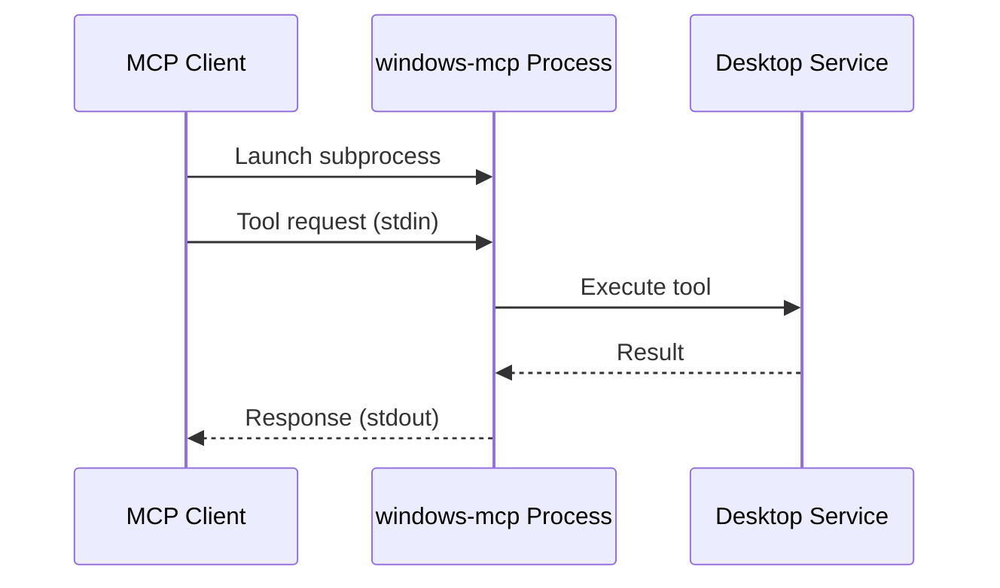

## Overview

Windows-MCP supports three transport layers for communication between MCP clients and the server. The transport layer determines how messages are encoded and transmitted.

<CardGroup cols={3}>
  <Card title="stdio" icon="terminal">
    Standard input/output for local processes
  </Card>
  
  <Card title="SSE" icon="rss">
    Server-Sent Events for network communication
  </Card>
  
  <Card title="streamable-http" icon="globe">
    HTTP streaming for production deployments
  </Card>
</CardGroup>

## stdio Transport (Default)

**stdio** (standard input/output) is the default and most common transport for MCP servers.

### How It Works



The MCP client launches Windows-MCP as a subprocess and communicates by:
- Sending JSON-RPC requests to **stdin**
- Receiving JSON-RPC responses from **stdout**

### Configuration

<Tabs>
  <Tab title="Claude Desktop">
    ```json claude_desktop_config.json
    {
      "mcpServers": {
        "windows-mcp": {
          "command": "uvx",
          "args": ["windows-mcp"]
        }
      }
    }
    ```
    
    No transport flag needed—stdio is the default.
  </Tab>
  
  <Tab title="Command Line">
    ```bash
    uvx windows-mcp
    # or explicitly:
    uvx windows-mcp --transport stdio
    ```
  </Tab>
</Tabs>

### Characteristics

| Aspect | Details |
|--------|--------|
| **Connection** | Process-local, no network |
| **Latency** | &lt;10ms |
| **Security** | Isolated to process |
| **Best For** | Claude Desktop, Cursor, local clients |
| **Limitations** | Single client, same machine |

### Use Cases

<Check>
  **Use stdio when:**
  - Connecting from Claude Desktop, Cursor, or similar desktop apps
  - You need minimal latency
  - You want the simplest setup
  - You're running client and server on the same machine
</Check>

## SSE Transport

**SSE** (Server-Sent Events) enables network-based communication using HTTP streaming.

### How It Works


The server listens on a network port and:
- Accepts HTTP connections from clients
- Sends responses as Server-Sent Events
- Maintains persistent connections for real-time updates

### Configuration

<CodeGroup>
```bash Start Server
uvx windows-mcp --transport sse --host localhost --port 8000
```

```json Client Config
{
  "mcpServers": {
    "windows-mcp": {
      "url": "http://localhost:8000/sse"
    }
  }
}
```
</CodeGroup>

### Parameters

<ParamField path="--transport" type="string" default="stdio">
  Set to `sse` to enable Server-Sent Events transport
</ParamField>

<ParamField path="--host" type="string" default="localhost">
  Host address to bind the server to (e.g., `0.0.0.0` for all interfaces)
</ParamField>

<ParamField path="--port" type="integer" default="8000">
  Port number for the HTTP server
</ParamField>

### Characteristics

| Aspect | Details |
|--------|--------|
| **Connection** | HTTP over network |
| **Latency** | 10-50ms (local network) |
| **Security** | Plain HTTP (use firewall/VPN) |
| **Best For** | Network clients, containers, development |
| **Limitations** | No built-in authentication |

### Use Cases

<Check>
  **Use SSE when:**
  - Client is in a container or VM on the same network
  - You need network accessibility for testing
  - You want real-time event streaming
  - You're developing custom MCP clients
</Check>

<Warning>
  SSE uses plain HTTP with no authentication. Only use on trusted networks or behind a VPN/firewall.
</Warning>

## streamable-http Transport

**streamable-http** provides production-ready HTTP streaming with better compatibility than SSE.

### How It Works


Similar to SSE, but uses bidirectional HTTP streaming:
- More compatible with proxies and load balancers
- Better connection management
- Recommended for production deployments

### Configuration

<CodeGroup>
```bash Start Server
uvx windows-mcp --transport streamable-http --host 0.0.0.0 --port 8000
```

```json Client Config
{
  "mcpServers": {
    "windows-mcp": {
      "url": "http://your-server:8000"
    }
  }
}
```
</CodeGroup>

### Parameters

Same as SSE transport:

<ParamField path="--transport" type="string" default="stdio">
  Set to `streamable-http` for HTTP streaming
</ParamField>

<ParamField path="--host" type="string" default="localhost">
  Host address to bind (use `0.0.0.0` for external access)
</ParamField>

<ParamField path="--port" type="integer" default="8000">
  Port number for the HTTP server
</ParamField>

### Characteristics

| Aspect | Details |
|--------|--------|
| **Connection** | HTTP streaming over network |
| **Latency** | 10-100ms (network dependent) |
| **Security** | Plain HTTP (add reverse proxy for HTTPS) |
| **Best For** | Production, remote access, cloud deployments |
| **Limitations** | Requires network configuration |

### Use Cases

<Check>
  **Use streamable-http when:**
  - Deploying in production
  - Using with reverse proxies (nginx, Caddy)
  - Need compatibility with load balancers
  - Connecting from remote networks
</Check>

### Production Setup

For production deployments, use a reverse proxy with HTTPS:

<CodeGroup>
```nginx nginx.conf
server {
    listen 443 ssl;
    server_name windows-mcp.example.com;
    
    ssl_certificate /path/to/cert.pem;
    ssl_certificate_key /path/to/key.pem;
    
    location / {
        proxy_pass http://localhost:8000;
        proxy_http_version 1.1;
        proxy_set_header Upgrade $http_upgrade;
        proxy_set_header Connection "upgrade";
        proxy_set_header Host $host;
    }
}
```

```yaml Caddyfile
windows-mcp.example.com {
    reverse_proxy localhost:8000
}
```
</CodeGroup>

## Transport Comparison

| Feature | stdio | SSE | streamable-http |
|---------|-------|-----|----------------|
| **Network** | No | Yes | Yes |
| **Latency** | &lt;10ms | 10-50ms | 10-100ms |
| **Setup** | Simplest | Moderate | Moderate |
| **Auth** | Process isolation | None | None (add via proxy) |
| **Production** | ❌ | ⚠️ | ✅ |
| **Firewall** | Not needed | Configure | Configure |
| **Multiple Clients** | No | Yes | Yes |

## Implementation Details

From `src/windows_mcp/__main__.py:748-796`:

```python
class Transport(Enum):
    STDIO = "stdio"
    SSE = "sse"
    STREAMABLE_HTTP = "streamable-http"

@click.command()
@click.option(
    "--transport",
    help="The transport layer used by the MCP server.",
    type=click.Choice([Transport.STDIO.value, Transport.SSE.value, Transport.STREAMABLE_HTTP.value]),
    default='stdio'
)
@click.option("--host", default="localhost", type=str)
@click.option("--port", default=8000, type=int)
def main(transport, host, port):
    match transport:
        case Transport.STDIO.value:
            mcp.run(transport=Transport.STDIO.value, show_banner=False)
        case Transport.SSE.value | Transport.STREAMABLE_HTTP.value:
            mcp.run(transport=transport, host=host, port=port, show_banner=False)
```

FastMCP handles the underlying transport implementation automatically based on the selected transport type.

## Choosing the Right Transport

<Steps>
  <Step title="Local Desktop Client?">
    Use **stdio** for Claude Desktop, Cursor, or any local MCP client
  </Step>
  
  <Step title="Development/Testing?">
    Use **SSE** for quick network testing and development
  </Step>
  
  <Step title="Production Deployment?">
    Use **streamable-http** with a reverse proxy for HTTPS
  </Step>
  
  <Step title="Remote Mode?">
    Transport is handled automatically by the proxy—you still configure stdio locally
  </Step>
</Steps>

## Security Considerations

<Warning>
  Network transports (SSE, streamable-http) expose Windows-MCP over HTTP without built-in authentication.
</Warning>

### Recommendations

<AccordionGroup>
  <Accordion title="Firewall Rules" icon="shield-halved">
    - Bind to `localhost` for local-only access
    - Use firewall rules to restrict access
    - Consider VPN for remote access
  </Accordion>
  
  <Accordion title="Reverse Proxy" icon="server">
    - Use nginx or Caddy for HTTPS
    - Add authentication (basic auth, OAuth)
    - Enable rate limiting
  </Accordion>
  
  <Accordion title="Network Segmentation" icon="network-wired">
    - Run on isolated network segments
    - Use VLANs for separation
    - Monitor access logs
  </Accordion>
</AccordionGroup>

## Next Steps

<CardGroup cols={2}>
  <Card title="Operating Modes" icon="toggle-on" href="/concepts/operating-modes">
    Learn about local vs remote deployment
  </Card>
  
  <Card title="UI Automation" icon="window-restore" href="/concepts/ui-automation">
    Understand how UIAutomation works
  </Card>
</CardGroup>