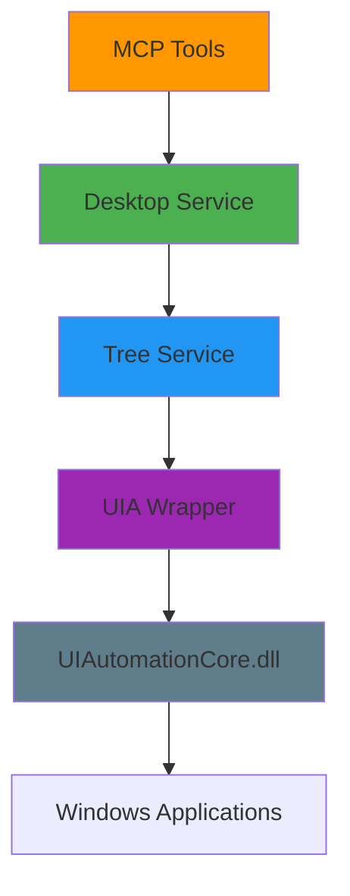

## Overview

Windows-MCP leverages **Microsoft UI Automation (UIA)** to interact with Windows desktop applications. Unlike traditional computer vision approaches, UIA provides programmatic access to the accessibility tree, enabling precise control without screenshots or OCR.

## What is UI Automation?

UI Automation is a Windows accessibility framework that:

<CardGroup cols={2}>
  <Card title="Exposes UI Elements" icon="diagram-project">
    Provides a hierarchical tree of UI controls with properties and patterns
  </Card>
  
  <Card title="Supports Multiple Frameworks" icon="layer-group">
    Works with MFC, WinForms, WPF, Qt, Electron, browsers, and more
  </Card>
  
  <Card title="Enables Automation" icon="robot">
    Allows programmatic interaction with buttons, text fields, menus, etc.
  </Card>
  
  <Card title="No Vision Required" icon="eye-slash">
    Reads UI structure directly—no screenshots or OCR needed
  </Card>
</CardGroup>

## Architecture Layers

Windows-MCP's UIAutomation integration follows a layered architecture:



### Layer 1: UIA Wrapper (`uia/`)

Low-level abstraction over the Windows UIAutomation COM API via `comtypes`.

**Key Files:**

<AccordionGroup>
  <Accordion title="uia/core.py" icon="code">
    Wraps the main UIAutomation COM object and provides utility functions:
    
    ```python
    class _AutomationClient:
        def __init__(self):
            ctypes.windll.ole32.CoInitialize(None)
            self.UIAutomationCore = comtypes.client.GetModule("UIAutomationCore.dll")
            self.IUIAutomation = comtypes.client.CreateObject(
                "{ff48dba4-60ef-4201-aa87-54103eef594e}",
                interface=self.UIAutomationCore.IUIAutomation,
            )
            self.ViewWalker = self.IUIAutomation.RawViewWalker
    ```
    
    Sets process DPI awareness to ensure coordinates match physical pixels:
    
    ```python
    SetProcessDpiAwareness(ProcessDpiAwareness.PerMonitorDpiAware)
    ```
  </Accordion>
  
  <Accordion title="uia/patterns.py" icon="puzzle-piece">
    Wraps UIAutomation patterns for interacting with controls:
    
    - **InvokePattern**: Click buttons
    - **ValuePattern**: Get/set text in edit controls
    - **ScrollPattern**: Scroll containers
    - **TogglePattern**: Toggle checkboxes
    - **ExpandCollapsePattern**: Expand/collapse tree nodes
    - **SelectionItemPattern**: Select list items
    - And 20+ more patterns
  </Accordion>
  
  <Accordion title="uia/controls.py" icon="window-restore">
    Defines control classes that wrap UI elements:
    
    - `Control`: Base class for all UI elements
    - `ButtonControl`, `EditControl`, `CheckBoxControl`
    - `ListControl`, `TreeControl`, `MenuControl`
    - `WindowControl`, `TabControl`, `ComboBoxControl`
  </Accordion>
  
  <Accordion title="uia/enums.py" icon="list">
    COM enumerations for control types, properties, patterns, and events.
  </Accordion>
  
  <Accordion title="uia/events.py" icon="bell">
    Handles UIAutomation event subscriptions for focus changes, property changes, etc.
  </Accordion>
</AccordionGroup>

### Layer 2: Tree Service (`tree/`)

Captures the Windows accessibility tree and identifies interactive/scrollable elements.

**From `tree/service.py:18-29`:**

```python
class Tree:
    def __init__(self, desktop: 'Desktop'):
        self.desktop = weakref.proxy(desktop)
        self.screen_size = desktop.get_screen_size()
        self.dom: Optional[Control] = None
        self.dom_bounding_box: BoundingBox = None
        self.screen_box = BoundingBox(
            top=0, left=0, 
            bottom=self.screen_size.height, 
            right=self.screen_size.width,
            width=self.screen_size.width, 
            height=self.screen_size.height
        )
```

**Key Features:**

<CardGroup cols={2}>
  <Card title="Tree Traversal" icon="sitemap">
    Recursively walks the UIA tree from window roots
  </Card>
  
  <Card title="Element Filtering" icon="filter">
    Identifies interactive, scrollable, and informative elements
  </Card>
  
  <Card title="Browser Detection" icon="globe">
    Special handling for Chrome, Edge, Firefox DOM extraction
  </Card>
  
  <Card title="Caching" icon="database">
    Uses UIA caching to reduce COM calls and improve performance
  </Card>
</CardGroup>

#### Tree Traversal Algorithm

From `tree/service.py:245-558`:

<Steps>
  <Step title="Start from Window Root">
    Begin traversal at the top-level window element
  </Step>
  
  <Step title="Check Visibility">
    Filter out offscreen elements (except EditControl, ListItemControl in browsers)
  </Step>
  
  <Step title="Identify Interactive Elements">
    Check if element is in `INTERACTIVE_CONTROL_TYPE_NAMES` or has interactive role
  </Step>
  
  <Step title="Extract Metadata">
    Capture properties: name, control type, bounding box, focus state, shortcuts, values
  </Step>
  
  <Step title="Find Scrollable Containers">
    Check for `ScrollPattern` to identify scrollable regions
  </Step>
  
  <Step title="Handle Special Cases">
    - **Browser DOM**: Extract web page elements from `RootWebArea`
    - **Modal Dialogs**: Clear other elements when modal window detected
    - **Nested Windows**: Recursively process child windows
  </Step>
  
  <Step title="Build TreeState">
    Return structured representation with interactive, scrollable, and text nodes
  </Step>
</Steps>

#### Caching for Performance

From `tree/cache_utils.py`:

```python
class CacheRequestFactory:
    @staticmethod
    def create_tree_traversal_cache():
        automation = _AutomationClient.instance()
        cache_request = automation.IUIAutomation.CreateCacheRequest()
        
        # Cache properties to avoid multiple COM calls
        cache_request.AddProperty(PropertyId.NameProperty)
        cache_request.AddProperty(PropertyId.LocalizedControlTypeProperty)
        cache_request.AddProperty(PropertyId.BoundingRectangleProperty)
        cache_request.AddProperty(PropertyId.IsKeyboardFocusableProperty)
        cache_request.AddProperty(PropertyId.HasKeyboardFocusProperty)
        # ... 20+ more properties
        
        # Cache patterns
        cache_request.AddPattern(PatternId.ScrollPattern)
        cache_request.AddPattern(PatternId.ValuePattern)
        cache_request.AddPattern(PatternId.TogglePattern)
        # ... more patterns
        
        return cache_request
```

Caching reduces tree traversal time from **5-10 seconds** to **0.5-2 seconds** by fetching all needed properties in a single COM call.

### Layer 3: Desktop Service (`desktop/`)

High-level orchestrator that manages desktop state, screenshots, and user actions.

**From `desktop/service.py:69-74`:**

```python
class Desktop:
    def __init__(self):
        self.encoding = getpreferredencoding()
        self.tree = Tree(self)
        self.desktop_state = None
```

**Key Responsibilities:**

<CardGroup cols={2}>
  <Card title="State Capture" icon="camera">
    Combines Tree service data with screenshots and cursor position
  </Card>
  
  <Card title="Mouse/Keyboard" icon="hand-pointer">
    Executes click, type, scroll, drag operations using UIA
  </Card>
  
  <Card title="Window Management" icon="window-maximize">
    Launch, resize, switch applications
  </Card>
  
  <Card title="Clipboard" icon="clipboard">
    Read/write clipboard content
  </Card>
</CardGroup>

### Layer 4: MCP Tools

Expose Desktop service capabilities as MCP tools.

```python
@mcp.tool(name="Snapshot")
def state_tool(use_vision: bool = False, use_dom: bool = False, ...):
    desktop_state = desktop.get_state(
        use_vision=use_vision,
        use_dom=use_dom,
        use_ui_tree=use_ui_tree,
        ...
    )
    return [
        f"Interactive Elements: {desktop_state.tree_state.interactive_elements}",
        Image(data=screenshot_bytes) if use_vision else None
    ]
```

## Key Design Details

### DPI Awareness

From CLAUDE.md:49-51:

> Mouse/keyboard input uses UIA (same coordinate space as BoundingRectangle; no DPI mismatch)

Windows-MCP sets **per-monitor DPI awareness** to ensure coordinates from UIAutomation match physical screen pixels:

```python uia/core.py
SetProcessDpiAwareness(ProcessDpiAwareness.PerMonitorDpiAware)
```

### Browser DOM Extraction

From CLAUDE.md:52:

> Browser detection (Chrome, Edge, Firefox) triggers special DOM extraction mode in Snapshot

When a browser window is detected (`tree/service.py:525-532`):

```python
if is_browser and child.CachedAutomationId == "RootWebArea":
    # Found the DOM root
    self.dom_bounding_box = BoundingBox(...)
    self.dom = child
    # Enter DOM subtree with special handling
    self.tree_traversal(child, ..., is_dom=True)
```

This extracts web page content separately from browser UI, enabling the `use_dom=True` mode.

### Fuzzy Matching

From CLAUDE.md:53:

> Fuzzy string matching (`thefuzz`) is used for element name matching

When users reference elements by name instead of coordinates, Windows-MCP uses fuzzy matching to find the best match:

```python
from fuzzywuzzy import process

match = process.extractOne(search_name, element_names)
if match[1] > 80:  # 80% similarity threshold
    return matched_element
```

### Retry Logic

From CLAUDE.md:54:

> UI element fetching has retry logic (`THREAD_MAX_RETRIES=3` in tree service)

From `tree/service.py:108-136`:

```python
for attempt in range(THREAD_MAX_RETRIES + 1):
    try:
        result = self.get_nodes(handle, is_browser, 
                                wait_time=0.5 * (2 ** (attempt - 1)))
        if result:
            interactive_nodes.extend(element_nodes)
            break
    except Exception as e:
        if attempt < THREAD_MAX_RETRIES:
            wait_time = 0.5 * (2 ** attempt)  # Exponential backoff
            sleep(wait_time)
        else:
            failed_handles.append(handle)
```

This handles transient errors when applications are still loading their UI.

## Control Type Categories

From `tree/config.py`:

### Interactive Controls

```python
INTERACTIVE_CONTROL_TYPE_NAMES = {
    'ButtonControl', 'EditControl', 'CheckBoxControl',
    'RadioButtonControl', 'ComboBoxControl', 'ListControl',
    'ListItemControl', 'MenuItemControl', 'TabItemControl',
    'HyperlinkControl', 'ImageControl', 'SliderControl',
    'SpinnerControl', 'SplitButtonControl', 'TreeItemControl'
}
```

### Document Controls

```python
DOCUMENT_CONTROL_TYPE_NAMES = {
    'DocumentControl', 'CustomControl', 'DataItemControl'
}
```

### Informative Controls

```python
INFORMATIVE_CONTROL_TYPE_NAMES = {
    'TextControl', 'HeaderControl', 'HeaderItemControl',
    'TitleBarControl', 'StatusBarControl', 'ToolTipControl',
    'ImageControl'
}
```

## Example: Click Flow

Let's trace how a click operation flows through the architecture:

<Steps>
  <Step title="MCP Client Request">
    Claude sends: `Click at [500, 300]`
  </Step>
  
  <Step title="Tool Invocation">
    `click_tool()` in `__main__.py` receives the request
  </Step>
  
  <Step title="Desktop Service">
    `desktop.click(loc=[500, 300], button="left", clicks=1)`
  </Step>
  
  <Step title="UIAutomation Execution">
    Uses `uia.Click(x=500, y=300)` from `uia/core.py`
  </Step>
  
  <Step title="Windows Input">
    Calls Win32 `mouse_event()` to simulate physical mouse click
  </Step>
  
  <Step title="Application Response">
    Windows app receives click event and updates UI
  </Step>
</Steps>

## Performance Characteristics

From CLAUDE.md:66:

> Typical latency between actions (e.g., from one mouse click to the next) ranges from **0.2 to 0.9 secs**

**Breakdown:**

- **Click execution**: &lt;50ms
- **Tree traversal**: 500-2000ms (with caching)
- **Screenshot capture**: 100-300ms
- **DOM extraction**: 200-500ms (browsers only)

## WatchDog Service

From `watchdog/service.py`:

Monitors UI focus changes in real-time to keep the Tree service current:

```python
class WatchDog:
    def start(self):
        # Subscribe to focus change events
        automation.AddFocusChangedEventHandler(
            cacheRequest=None,
            handler=self._on_focus_changed
        )
    
    def _on_focus_changed(self, sender, event):
        # Notify Tree service of focus change
        self.focus_callback(sender)
```

This enables Windows-MCP to track which element has keyboard focus without constantly polling.

## Limitations

From README.md:460-464:

<Warning>
  **Current Limitations:**
  
  - Selecting specific text within paragraphs (relies on accessibility tree, not text ranges)
  - Typing full programs in IDEs (types entire file at once, not incremental)
  - Playing video games (not designed for real-time input)
</Warning>

## Security Context

From CLAUDE.md:57-59:

> This server has **full system access** with no sandboxing. Tools like Shell and App can perform irreversible operations. The recommended deployment target is a VM or Windows Sandbox.

## Next Steps

<CardGroup cols={2}>
  <Card title="MCP Protocol" icon="handshake" href="/concepts/mcp-protocol">
    Learn how MCP protocol ties it all together
  </Card>
  
  <Card title="Tools Reference" icon="wrench" href="/tools/snapshot">
    Explore all 15+ MCP tools
  </Card>
</CardGroup>