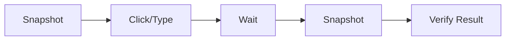
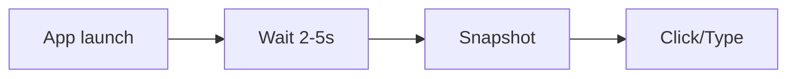
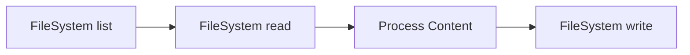
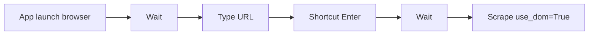
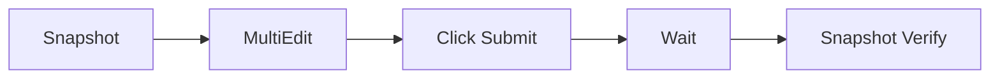

Windows-MCP provides 17 powerful tools for Windows automation, organized into three categories: System Tools, UI Interaction Tools, and Advanced Tools.

## Quick Reference

<AccordionGroup>
  <Accordion title="All Tools at a Glance" icon="table">
    | Tool | Category | Description | Risk Level |
    |------|----------|-------------|------------|
    | [Snapshot](/tools/snapshot) | UI Interaction | Captures desktop state with UI elements and screenshots | Low |
    | [Click](/tools/click) | UI Interaction | Performs mouse clicks at coordinates or labels | Medium |
    | [Type](/tools/type) | UI Interaction | Types text into input fields | Medium |
    | [Scroll](/tools/scroll) | UI Interaction | Scrolls content vertically or horizontally | Low |
    | [Move](/tools/move) | UI Interaction | Moves mouse cursor or performs drag-and-drop | Low |
    | [Shortcut](/tools/shortcut) | UI Interaction | Executes keyboard shortcuts | Medium |
    | [Wait](/tools/wait) | UI Interaction | Pauses execution for specified duration | Low |
    | [App](/tools/app) | System | Launches apps, resizes/switches windows | High |
    | [PowerShell](/tools/shell) | System | Executes PowerShell commands | High |
    | [FileSystem](/tools/filesystem) | System | Manages files and directories | High |
    | [Process](/tools/process) | System | Lists and terminates processes | High |
    | [Registry](/tools/registry) | System | Accesses Windows Registry | High |
    | [Clipboard](/tools/clipboard) | System | Manages clipboard operations | Low |
    | [Notification](/tools/notification) | System | Sends toast notifications | Low |
    | [Scrape](/tools/scrape) | Advanced | Fetches web content from URLs or browser tabs | Medium |
    | [MultiSelect](/tools/multiselect) | Advanced | Selects multiple UI elements | Medium |
    | [MultiEdit](/tools/multiedit) | Advanced | Edits multiple input fields | Medium |
  </Accordion>
</AccordionGroup>

## Tool Categories

<CardGroup cols={3}>
  <Card title="System Tools" icon="terminal" href="#system-tools">
    7 tools for system-level operations
  </Card>
  <Card title="UI Interaction" icon="mouse-pointer" href="#ui-interaction-tools">
    7 tools for desktop interaction
  </Card>
  <Card title="Advanced Tools" icon="sparkles" href="#advanced-tools">
    3 tools for batch operations
  </Card>
</CardGroup>

---

## System Tools

Tools for managing applications, files, processes, and system configuration.

<CardGroup cols={2}>
  <Card title="App" icon="window-maximize" href="/tools/app">
    Launch applications, resize windows, and switch focus
    
    **Modes:** launch, resize, switch
  </Card>
  
  <Card title="PowerShell" icon="terminal" href="/tools/shell">
    Execute PowerShell commands for system automation
    
    **Risk:** Full system access
  </Card>
  
  <Card title="FileSystem" icon="folder" href="/tools/filesystem">
    Comprehensive file operations with 8 modes
    
    **Modes:** read, write, copy, move, delete, list, search, info
  </Card>
  
  <Card title="Process" icon="microchip" href="/tools/process">
    List running processes and terminate them
    
    **Modes:** list, kill
  </Card>
  
  <Card title="Registry" icon="database" href="/tools/registry">
    Read and modify Windows Registry entries
    
    **Modes:** get, set, delete, list
  </Card>
  
  <Card title="Clipboard" icon="clipboard" href="/tools/clipboard">
    Get and set clipboard text content
    
    **Modes:** get, set
  </Card>
  
  <Card title="Notification" icon="bell" href="/tools/notification">
    Send Windows toast notifications to the user
    
    **Use Case:** Remote alerts
  </Card>
</CardGroup>

---

## UI Interaction Tools

Tools for observing and interacting with the Windows desktop interface.

<CardGroup cols={2}>
  <Card title="Snapshot" icon="camera" href="/tools/snapshot">
    Capture desktop state with UI tree and optional screenshot
    
    **Always use first** to understand current state
  </Card>
  
  <Card title="Click" icon="hand-pointer" href="/tools/click">
    Perform left, right, or middle clicks at coordinates
    
    **Supports:** hover, single click, double click
  </Card>
  
  <Card title="Type" icon="keyboard" href="/tools/type">
    Type text into input fields with options
    
    **Features:** clear, caret positioning, press enter
  </Card>
  
  <Card title="Scroll" icon="arrows-up-down" href="/tools/scroll">
    Scroll content vertically or horizontally
    
    **Control:** direction, wheel times
  </Card>
  
  <Card title="Move" icon="up-right-from-square" href="/tools/move">
    Move mouse cursor or drag-and-drop
    
    **Modes:** hover, drag
  </Card>
  
  <Card title="Shortcut" icon="command" href="/tools/shortcut">
    Execute keyboard shortcuts like Ctrl+C, Alt+Tab
    
    **Examples:** copy, paste, switch apps
  </Card>
  
  <Card title="Wait" icon="clock" href="/tools/wait">
    Pause execution for applications to load
    
    **Use Case:** Ensure UI readiness
  </Card>
</CardGroup>

---

## Advanced Tools

Specialized tools for web scraping and batch operations.

<CardGroup cols={3}>
  <Card title="Scrape" icon="globe" href="/tools/scrape">
    Fetch web content from URLs or extract from browser DOM
    
    **Features:** HTTP requests, DOM extraction, LLM summarization
  </Card>
  
  <Card title="MultiSelect" icon="square-check" href="/tools/multiselect">
    Select multiple files, folders, or checkboxes
    
    **Control:** Ctrl+click or batch click
  </Card>
  
  <Card title="MultiEdit" icon="pen-to-square" href="/tools/multiedit">
    Enter text into multiple input fields at once
    
    **Efficient:** Batch form filling
  </Card>
</CardGroup>

---

## Common Workflows

### Basic Desktop Interaction



**Typical sequence:**
1. **Snapshot** - Understand current desktop state
2. **Click/Type** - Interact with UI elements
3. **Wait** - Allow UI to respond
4. **Snapshot** - Verify the action succeeded

### Application Launch Workflow



**Best practice:**
1. **App** (mode=launch) - Open the application
2. **Wait** - Allow app to fully load (2-5 seconds)
3. **Snapshot** - Capture available UI elements
4. **Interact** - Use Click, Type, etc.

### File Operations Workflow



**Common pattern:**
1. **FileSystem** (mode=list) - List directory contents
2. **FileSystem** (mode=read) - Read file content
3. **Process** - Manipulate data
4. **FileSystem** (mode=write) - Save results

### Web Scraping Workflow



**For protected sites:**
1. **App** - Launch browser
2. **Type** - Enter URL in address bar
3. **Shortcut** - Press Enter
4. **Wait** - Page load time
5. **Scrape** (use_dom=True) - Extract content from browser DOM

### Form Automation Workflow



**Efficient form filling:**
1. **Snapshot** - Get all field labels/coordinates
2. **MultiEdit** - Fill all fields at once
3. **Click** - Submit button
4. **Wait** - Processing time
5. **Snapshot** - Verify submission

---

## Best Practices

<AccordionGroup>
  <Accordion title="Always Start with Snapshot" icon="1">
    Before any interaction, call **Snapshot** to understand the current desktop state. This provides:
    - Available windows and their positions
    - Interactive elements with coordinates
    - Scrollable areas
    - Current focus state
    
    Set `use_vision=True` to include a screenshot for visual verification.
  </Accordion>

  <Accordion title="Use Labels Instead of Coordinates" icon="2">
    When possible, use UI element labels/IDs rather than hardcoded coordinates:
    
    ```python
    # Good - uses label from Snapshot
    Click(label=42)
    
    # Less robust - hardcoded coordinates
    Click(loc=[450, 300])
    ```
    
    Labels are more reliable as they adapt to UI changes.
  </Accordion>

  <Accordion title="Add Wait Between Actions" icon="3">
    Always include **Wait** after actions that trigger:
    - Application launches (2-5 seconds)
    - Page loads (2-4 seconds)
    - Dialog appearances (1-2 seconds)
    - Animations or transitions (0.5-1 second)
    
    Typical latency: 0.2-0.9 seconds per action.
  </Accordion>

  <Accordion title="Verify Actions with Snapshot" icon="4">
    After important operations, call **Snapshot** again to verify success:
    
    ```
    1. Snapshot → Get initial state
    2. Click → Perform action
    3. Wait → Allow UI to update
    4. Snapshot → Verify result
    ```
  </Accordion>

  <Accordion title="Handle Errors Gracefully" icon="5">
    Tools return error messages when operations fail. Always check responses:
    - **FileSystem** errors: File not found, permission denied
    - **Click/Type** errors: Element not found, desktop state empty
    - **PowerShell** errors: Command failed with status code
    
    Call **Snapshot** first to avoid "Desktop state is empty" errors.
  </Accordion>

  <Accordion title="Use Relative Paths for FileSystem" icon="6">
    Relative paths in **FileSystem** are resolved from the user's Desktop:
    
    ```
    # Relative - resolves to Desktop/report.txt
    FileSystem(mode='read', path='report.txt')
    
    # Absolute - direct path
    FileSystem(mode='read', path='C:\\Users\\John\\Documents\\report.txt')
    ```
  </Accordion>

  <Accordion title="Combine Tools Efficiently" icon="7">
    Use **MultiSelect** and **MultiEdit** for batch operations instead of loops:
    
    ```
    # Efficient - single call
    MultiSelect(labels=[10, 11, 12, 13], press_ctrl=True)
    
    # Inefficient - multiple calls
    Click(label=10)
    Click(label=11, button='left')
    Click(label=12, button='left')
    ```
  </Accordion>

  <Accordion title="Scrape with LLM Sampling" icon="8">
    For web content, use **Scrape** with `use_sampling=True` (default) to get clean, summarized content:
    
    ```
    # Clean summary without boilerplate
    Scrape(url='https://example.com', use_sampling=True)
    
    # Focused extraction
    Scrape(url='https://example.com', query='pricing information')
    ```
  </Accordion>

  <Accordion title="Use DOM Mode for Browser Content" icon="9">
    When scraping sites that block HTTP requests, use DOM extraction:
    
    ```
    1. App(mode='launch', name='chrome')
    2. Wait(duration=2)
    3. Snapshot(use_dom=True) → Get browser elements
    4. Scrape(url='site.com', use_dom=True) → Extract from active tab
    ```
  </Accordion>

  <Accordion title="Understand Risk Levels" icon="10">
    Tools are categorized by destructive potential:
    
    **High Risk:** App, PowerShell, FileSystem, Process, Registry
    - Can modify system state permanently
    - Recommended for VM/sandbox deployment
    
    **Medium Risk:** Click, Type, Shortcut, Scrape, MultiSelect, MultiEdit
    - Can trigger actions but limited scope
    
    **Low Risk:** Snapshot, Scroll, Move, Wait, Clipboard, Notification
    - Read-only or non-destructive operations
  </Accordion>
</AccordionGroup>

---

## Tool Chains

Common sequences of tools for specific tasks:

### QA Testing

```
Snapshot → Click → Wait → Snapshot → Verify
```

Test UI workflows by capturing before/after states.

### Data Extraction

```
App launch → Wait → Snapshot → MultiEdit → Click → Wait → Scrape
```

Fill forms, submit, and extract results.

### System Monitoring

```
Process(mode='list') → FileSystem(mode='write') → Notification
```

Monitor processes and alert on conditions.

### Bulk File Operations

```
FileSystem(mode='search') → PowerShell → FileSystem(mode='move')
```

Find files matching patterns and organize them.

### Browser Automation

```
App → Wait → Type URL → Shortcut(Enter) → Wait → Snapshot(use_dom=True) → Scrape(use_dom=True)
```

Navigate and extract web content.

---

## Performance Tips

<Note>
  **Typical latency** between actions: 0.2-0.9 seconds (varies by system load and LLM inference speed)
</Note>

- **Minimize Snapshot calls**: Only capture state when needed (before interactions, after changes)
- **Use `use_vision=False`**: Skip screenshots when visual verification isn't required
- **Batch operations**: Use MultiSelect/MultiEdit instead of loops
- **Optimize Wait durations**: Don't wait longer than necessary
- **Disable UI tree**: Set `use_ui_tree=False` for screenshot-only snapshots
- **Limit display scope**: Use `display=[0]` to capture single monitor

---

## Security Considerations

<Warning>
  Windows-MCP has **full system access** with no sandboxing. Deploy in a VM or Windows Sandbox for safety.
</Warning>

### High-Risk Operations

- **PowerShell**: Can execute any system command
- **Registry**: Can modify system configuration
- **FileSystem**: Can delete files permanently
- **Process**: Can terminate critical processes
- **App**: Can launch potentially harmful applications

### Recommended Deployment

1. **Windows Sandbox** - Isolated environment (recommended)
2. **Virtual Machine** - Full OS isolation
3. **Local with caution** - Only for trusted automation

### Environment Variables

Control behavior with environment variables:
- `MODE=local` or `MODE=remote` - Deployment mode
- `ANONYMIZED_TELEMETRY=false` - Disable usage tracking
- `SANDBOX_ID` and `API_KEY` - For remote mode

---

## Next Steps

<CardGroup cols={2}>
  <Card title="Explore Individual Tools" icon="magnifying-glass" href="/tools/snapshot">
    Detailed documentation for each tool with examples
  </Card>
  
  <Card title="Tutorials" icon="graduation-cap" href="/quickstart">
    Step-by-step guides for common automation tasks
  </Card>
  
  <Card title="Configuration" icon="gear" href="/configuration/modes">
    Set up Windows-MCP for local or remote mode
  </Card>
  
  <Card title="API Reference" icon="code" href="/tools/overview">
    Complete API documentation and schemas
  </Card>
</CardGroup>
